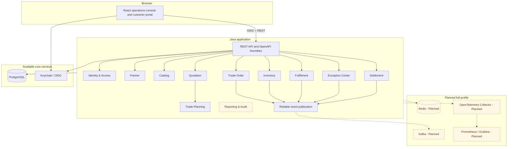
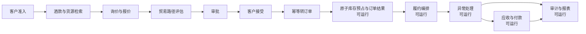

# CellarBridge

**An explainable B2B wine trade orchestration platform, from quotation to delivery.**  
**一个从询报价到交付的可解释酒饮 B2B 贸易协同平台。**

[English](#english) · [简体中文](#简体中文)

> **Project status — Audit and reporting available.** The executable flow now continues through settlement into event-projected work queues, immutable audit evidence, unified timelines, and permission-filtered operational dashboards.

---

## English

### 1. Why this project exists

CellarBridge models a realistic target workflow for a wine importer and B2B supply-chain operator. It is not a consumer storefront and it is not a collection of disconnected CRUD screens. The executable scope currently runs from customer eligibility and supply search through quotation, idempotent order creation, Inventory-owned reservation, Fulfillment, exception recovery, permission-scoped receivables, and eventually consistent audit/reporting projections.

The project is designed to make engineering decisions easy to inspect. A reviewer can trace a business requirement from the product specification to a bounded context, aggregate invariant, API or event contract, database ownership rule, acceptance scenario, and implementation task.

### 2. Core business scenario

In the target scenario, a sales representative prepares a customer-specific quotation for several wine SKUs. The platform evaluates eligible delivery routes, explains why each route is accepted or rejected, calculates a versioned price breakdown, and requests approval when margin or discount policies are exceeded. The executable core continues through customer acceptance, exactly-one-order creation, atomic Inventory reservation, route-specific Fulfillment, source-verified exception recovery, and fulfillment-triggered receivables with external payment and reversal evidence. Those reliable business events feed tenant-scoped audit, timeline, work-item, and metric projections.

```mermaid
flowchart LR
    A[Partner onboarding] --> B[Catalog and supply search]
    B --> C[Quotation]
    C --> D[Trade-route evaluation]
    D --> E[Approval]
    E --> F[Customer acceptance]
    F --> G[Idempotent order conversion]
    G --> H[Atomic reservation + order outcome<br/>Available]
    H --> I[Fulfillment orchestration<br/>Available]
    I --> J[Exception handling<br/>Available]
    J --> K[Receivable and payment<br/>Available]
    J --> L[Audit and reporting<br/>Available]
    K --> L

```



### 3. Product capabilities

| Capability                                         | Business value                                                                                                                              | Baseline state |
| -------------------------------------------------- | ------------------------------------------------------------------------------------------------------------------------------------------- | -------------- |
| Identity, tenant and permission access             | Establishes a non-forgeable tenant context and protected operations navigation                                                              | Available      |
| Partner onboarding and channel eligibility         | Prevents transactions with inactive or ineligible customers                                                                                 | Available      |
| Wine product, SKU, lot, and supply-pool search     | Preserves vintage, package, provenance, availability semantics, and field-level visibility                                                  | Available      |
| Customer-specific quotation workflow               | Freezes commercial terms and supports approval policies                                                                                     | Available      |
| Explainable trade-route evaluation                 | Compares delivery options by hard constraints and weighted scores                                                                           | Available      |
| Secure customer quotation decision                 | Provides a strict public view, idempotent accept/reject, expiry processing, and a durable acceptance fact                                   | Available      |
| Quote-to-order conversion                          | Uses an Inbox, immutable snapshots, and database uniqueness so an accepted quote produces at most one order                                 | Available      |
| Unit-aware inventory readiness                     | Separates CASE/BOTTLE facts and exposes warehouse priority/version only to authorized exact-stock users                                     | Available      |
| Route-bound Supply Decision freeze and propagation | Preserves AUTO/FIXED route constraints and one verified decision from quotation to order                                                    | Available      |
| Inventory reservation                              | Prevents overselling, applies verified order outcomes, and exposes permission-scoped operations evidence                                    | Available      |
| Fulfillment plans and milestones                   | Applies versioned route templates, dependency rules, SLA state, simulated adapter evidence, and customer-safe milestones                    | Available      |
| Exception center                                   | Deduplicates shortages, delays, failed steps, and terminal delivery failures into owned work with source-verified recovery                  | Available      |
| Receivables and payment records                    | Creates one versioned fulfillment-triggered receivable and preserves idempotent, immutable payment/reversal evidence without a real gateway | Available      |
| Audit trail and operational read models            | Supports immutable evidence, unified timelines, actionable work queues, and permission-filtered dashboards                                  | Available      |

### 4. Architecture at a glance

CellarBridge starts as a **domain-oriented modular monolith**. This is a deliberate choice: the business needs strong consistency inside aggregates, clear module ownership, simple local execution, and credible extraction paths—not distributed-system ceremony before it is justified.



The principal architecture rules are:

- business modules communicate only through published module APIs and versioned events;
- each module owns its tables and migrations; cross-module foreign keys are avoided;
- accepted quotations and orders store immutable commercial snapshots;
- critical commands are idempotent and use database constraints as the final guard;
- inventory correctness never depends on cache or distributed locks;
- external event delivery is at-least-once, so consumers must be idempotent;
- PostgreSQL search is preferred over a separate search cluster for the expected catalog size;
- every architectural exception requires an Architecture Decision Record.

### 5. Technology baseline

| Area          | Baseline                                                                                                                                                              |
| ------------- | --------------------------------------------------------------------------------------------------------------------------------------------------------------------- |
| Backend       | Current: Java 21 LTS, Spring Boot 4.1, Spring Modulith 2.1, Spring Security, Spring JDBC / SQL-first. JPA is optional and not installed                               |
| API           | REST, OpenAPI 3.1, RFC 9457-style problem details, generated TypeScript types                                                                                         |
| Data          | PostgreSQL 18, Flyway, schema-per-module ownership, JSONB only for snapshots and event envelopes                                                                      |
| Messaging     | Current: custom transactional local publication and Consumer Inbox. Kafka 4.3 is a planned full-profile external channel                                              |
| Cache         | Redis 8 is planned for a future full profile and is not part of the current runtime                                                                                   |
| Identity      | Keycloak 26, OIDC Authorization Code with PKCE, JWT resource server                                                                                                   |
| Frontend      | Current: React 19.2, TypeScript, Vite 8, React Router, TanStack Query, Ant Design, React Hook Form, Zod, ECharts 6                                                    |
| Quality       | JUnit, AssertJ, Testcontainers, ArchUnit, Spring Modulith verification, Vitest, Testing Library, Playwright                                                           |
| Observability | Current: Actuator/Micrometer and safe application logs. OpenTelemetry, Prometheus, and Grafana are planned                                                            |
| Delivery      | Current: Maven Wrapper, pnpm, core Docker Compose, GitHub Actions, secret scan, and frontend dependency audit. SBOM and broader dependency/image scanning are planned |

Current versions and planned targets are recorded separately in [the technology baseline](docs/03-architecture/13-technology-baseline.md); a planned target is not evidence that the dependency is installed.

### 6. What is technically distinctive

**Business correctness before framework code.** Aggregates define explicit state transitions and invariants. Monetary values never use floating-point types. Time comes from an injected clock. Accepted commercial data is never recalculated silently.

**Explainable route decisions.** The trade-planning engine rejects invalid routes with machine-readable reason codes and scores valid routes using versioned policies. A manager may override a recommendation only with a recorded reason.

**Concurrency demonstrated through reservation execution.** Task 08 B1 combines deterministic candidate locking with exact PostgreSQL conditional updates. Controlled contention proves no oversell and multi-line rollback. B2 serializes competing outcomes under the Trade Order row lock, validates request/decision hashes, and preserves the first terminal result across duplicate or out-of-order delivery.

**Reliable asynchronous collaboration.** The current core uses persisted local event publications and idempotent Consumer Inbox handlers. Correlation and causation identifiers are retained for business evidence; external broker delivery and trace export remain planned.

**Architecture as an executable constraint.** Current Spring Modulith and ArchUnit tests enforce module cycles, internal-package boundaries, selected dependency directions, and domain isolation. Remaining fitness functions are explicitly marked partial or planned.

**Reviewer-friendly operation.** The target release provides synthetic demo data, role-based demo accounts, a deterministic walkthrough, one-command local startup, health checks, API documentation, dashboards, and a concise technical review path.

### 7. Repository map

```text
.
├── AGENTS.md                    Repository-wide engineering rules
├── README.md                    Bilingual project overview
├── backend/                    Spring Boot modular-monolith application
├── frontend/                   React operations console
├── contracts/                  OpenAPI, AsyncAPI, JSON Schemas, examples
├── deploy/                     Core Docker Compose environment; full profiles planned
├── docs/
│   ├── 00-research/             Evidence, business model, scenario selection
│   ├── 01-product/              Vision, requirements, workflows, page specs
│   ├── 02-domain/               Context map, aggregates, invariants, events
│   ├── 03-architecture/         Architecture, ADRs, security, operations
│   ├── 04-contracts/            Data, API, permissions, audit conventions
│   └── 05-delivery/             Roadmap, quality gates, review and release plan
├── scripts/                     Validation and local smoke checks
└── .github/                     Contribution templates and quality workflows
```

The executable application keeps every Spring Modulith business module as a direct child of
`com.rom.cellarbridge`. Identity/access, partner onboarding, catalog/supply search, quotation/trade planning, customer quotation decisions, quote-to-order conversion, Inventory reservation, Fulfillment orchestration, the Exception Center, Settlement, and Audit/Reporting are available.

### 8. Run the foundation

Prerequisites are Java 21, Node.js 24, Corepack/pnpm 11, Python 3.12 with the validation
dependencies shown in the documentation CI, Docker, and Docker Compose. The committed wrappers
and lockfiles define the build inputs.

```bash
cp .env.example .env            # optional local overrides; .env is ignored
make validate                   # static, format, generated-code, and Compose checks
make test                       # backend integration/architecture and frontend tests
make dev-core                   # PostgreSQL, Keycloak, backend, and frontend
make smoke-core                 # isolated build, health verification, and cleanup
make identity-e2e               # real OIDC login and two-tenant isolation
make partner-e2e                # partner submission, independent review, and self-review denial
make catalog-e2e                # catalog search, local quote selection, and Buyer denial
make quotation-e2e              # quotation routing, approval, issue, and safe preview
make acceptance-e2e             # customer acceptance, double-click, receipt, and refresh safety
make order-e2e                  # quote conversion, Reservation operations, and Buyer-safe access
make fulfillment-e2e            # route plan, dependency actions, milestones, and Buyer-safe access
make exception-e2e              # failure capture, source-verified recovery, and reviewed closure
make settlement-e2e             # fulfillment-triggered receivable, partial/full payment, and reversal
make reporting-e2e              # projected work queue, dashboard, audit, and unified timeline
make catalog-benchmark          # deterministic PostgreSQL search plan and p50/p95 evidence
```

After `make dev-core`, open <http://localhost:5173/app>. Backend readiness is available at
<http://localhost:8080/actuator/health/readiness>, and Keycloak is available at
<http://localhost:8081>. Sign in with synthetic local account `north.sales`, `north.buyer`,
`north.manager`, `north.trade`, `north.warehouse`, `north.admin`, `north.finance`, `north.auditor`,
`north.operator`, or `harbor.manager`; their demo-only password is
`CellarBridge-Demo-2026!`. These credentials exist only in the local `demo` profile and must never
be reused in production. Stop the profile with
`make stop-core`; see the [identity access runbook](docs/05-delivery/13-identity-access-runbook.md),
the [partner onboarding runbook](docs/05-delivery/14-partner-onboarding-runbook.md), and the
[catalog supply search runbook](docs/05-delivery/15-catalog-supply-search-runbook.md), and the
[quotation and trade-planning runbook](docs/05-delivery/16-quotation-trade-planning-runbook.md), and the
[customer quotation acceptance runbook](docs/05-delivery/17-customer-quotation-acceptance-runbook.md), and the
[trade order conversion runbook](docs/05-delivery/18-trade-order-conversion-runbook.md), and the
[fulfillment orchestration runbook](docs/05-delivery/19-fulfillment-orchestration-runbook.md), and the
[Exception Center runbook](docs/05-delivery/20-exception-center-runbook.md), and the
[Settlement runbook](docs/05-delivery/21-settlement-runbook.md), and the
[Audit and reporting runbook](docs/05-delivery/22-audit-reporting-runbook.md).

Regenerate the checked-in TypeScript API boundary with `make generate-api-client`. The source
OpenAPI remains authoritative; `/me`, `/partners*`, `/catalog/skus*`, `/quotations*`, and the
customer-safe portal view/acceptance/rejection endpoints are implemented. Internal `/orders*` and
Partner-scoped `/buyer/orders*`, tenant-scoped `/inventory/reservations*`, tenant-scoped
`/fulfillment/plans*`, `/exceptions*`, failed-publication operations, order outcome consumption,
and the Reservation/Fulfillment/Exception workbenches are also implemented. Tenant-scoped
`/receivables*` payment/reversal commands and the Settlement workspace are available. Tenant-scoped
`/dashboard`, `/audit/entries`, `/timeline`, and `/work-items` projections and their React views are
also available.

### 9. Suggested review paths

- **10 minutes:** this README → [reviewer guide](docs/reviewer-guide.md) → [architecture overview](docs/03-architecture/00-architecture-overview.md)
- **30 minutes:** add [scenario selection](docs/00-research/07-scenario-selection.md), [aggregate invariants](docs/02-domain/04-aggregates-and-invariants.md), [inventory concurrency design](docs/03-architecture/08-performance-and-scalability.md), and the [requirement traceability matrix](docs/05-delivery/11-requirement-traceability.md)
- **60 minutes:** add the [OpenAPI contract](contracts/openapi/cellarbridge-api.yaml), [event contract](contracts/asyncapi/cellarbridge-events.yaml), [database design](docs/04-contracts/05-database-design.md), [testing strategy](docs/05-delivery/03-testing-strategy.md), and the [technical reviewer scorecard](docs/05-delivery/12-reviewer-scorecard.md)

### 10. Delivery status

| Stage                                              | State     |
| -------------------------------------------------- | --------- |
| Evidence-backed research                           | Available |
| Product and domain design                          | Available |
| Architecture and contracts                         | Available |
| Repository governance                              | Available |
| Java and React workspace                           | Available |
| Core local runtime and CI quality gates            | Available |
| Identity and tenant access slice                   | Available |
| Partner onboarding business slice                  | Available |
| Catalog and unit-aware supply search slice         | Available |
| Inventory unit and warehouse-priority readiness    | Available |
| Quotation and trade-planning slice                 | Available |
| Customer quotation decision slice                  | Available |
| Quote-to-order conversion slice                    | Available |
| Route-bound Supply Decision freeze and propagation | Available |
| Inventory reservation slice                        | Available |
| Fulfillment orchestration slice                    | Available |
| Exception Center and recovery slice                | Available |
| Settlement receivables and payments slice          | Available |
| Audit and reporting slice                          | Available |
| Performance and security evidence                  | Planned   |
| Public demo release                                | Planned   |

The implementation roadmap is maintained in [docs/05-delivery/00-implementation-roadmap.md](docs/05-delivery/00-implementation-roadmap.md). The README must be updated as each capability becomes executable; planned work must never be presented as completed work.

### 11. Disclaimer

CellarBridge is an independent technical demonstration based on public business information and general supply-chain domain analysis. It is not an official product of Chengdu Fine West International Trade Co., Ltd., FineWest, WineMatcher, or any related brand. Company and brand names appear only in the research record. All customers, products, prices, inventory, orders, and operational events used by the project are synthetic.

---

## 简体中文

### 1. 项目定位

CellarBridge（酒桥）模拟一家进口酒饮供应链服务商的目标企业流程。它不是面向消费者的酒类商城，也不是把若干 CRUD 页面拼在一起的后台模板。当前可运行闭环已从库存预占、路线绑定履约和异常恢复继续延伸到应收、外部付款事实、不可变冲正，以及最终一致的审计、工作队列和经营报表。

本项目强调“设计可以被审阅”。技术评审者可以从一条业务需求出发，继续追踪到限界上下文、聚合不变量、接口或事件契约、数据库归属、验收场景和实现任务，而不需要依赖口头补充来理解系统。

### 2. 核心业务场景

在目标场景中，销售人员为商业客户选择多个酒款 SKU，并生成客户专属报价。系统根据客户资格、货源位置、目标交付时间、交付区域和成本构成评估可用的贸易交付路径；每个候选方案都给出可解释的通过、拒绝原因和评分。当前可执行核心继续覆盖审批、客户接受、唯一订单创建、Inventory 原子预留、路线专属履约、源状态验证的异常恢复，以及履约完成后自动应收、部分/全额付款和部分冲正；可靠业务事件继续投影为审计、统一时间线、工作项与指标。



### 3. 产品能力

| 能力                        | 解决的问题                                                                           | 基线状态 |
| --------------------------- | ------------------------------------------------------------------------------------ | -------- |
| 身份、租户与权限访问        | 建立不可伪造的租户上下文和受保护的运营导航                                           | 可运行   |
| 商业客户准入与渠道资格      | 防止未激活、已停用或不具备交付资格的客户参与交易                                     | 可运行   |
| 酒款、SKU、批次与货源池检索 | 准确表达年份、包装、来源、库存位置、非承诺可用性和字段权限                           | 可运行   |
| 客户专属报价与审批          | 固化商业条件，管理折扣、毛利和审批责任                                               | 可运行   |
| 可解释贸易路径评估          | 用硬约束与加权评分比较多种交付方案                                                   | 可运行   |
| 客户安全报价决定            | 提供严格公开视图、幂等接受/拒绝、到期处理与可靠接受事实                              | 可运行   |
| 报价转订单                  | 通过 Inbox、不可变快照与数据库唯一约束保证同一份已接受报价最多生成一个订单           | 可运行   |
| 库存单位准备度              | 将 CASE/BOTTLE 事实分开，并只向授权精确库存用户展示仓库优先级/版本                   | 可运行   |
| 路线绑定供给决策冻结与传播  | 将 AUTO/FIXED、路线、单位、Pool/Type 和哈希证据从报价一致传播到订单                  | 可运行   |
| 库存预占                    | 防止超卖，并将校验后的结果幂等应用到订单                                             | 可运行   |
| 履约计划与节点              | 应用版本化路线模板、依赖规则、SLA 状态、模拟适配器证据和客户安全里程碑               | 可运行   |
| 异常中心                    | 将缺货、延迟、节点失败和最终投递失败去重为工作项，并执行源状态验证恢复               | 可运行   |
| 应收与付款记录              | 通过版本化履约触发创建唯一应收，并保存幂等、不可变的付款与冲正事实，不接真实支付网关 | 可运行   |
| 审计与经营读模型            | 提供不可变证据、统一时间线、工作队列和权限过滤经营看板                               | 可运行   |

### 4. 架构概览

项目采用**领域驱动的模块化单体**作为起点。这不是对微服务能力的回避，而是基于当前业务规模、团队协作、事务边界和演示可运行性做出的工程判断。系统先通过明确模块边界、独立数据归属、可靠事件和架构测试获得可拆分性；只有在独立扩缩容、发布节奏、团队所有权或故障隔离确有需要时，才考虑提取服务。

核心规则如下：

- 模块之间只能通过公开模块接口和版本化事件协作；
- 每个模块拥有自己的表和迁移，原则上不建立跨模块外键；
- 已接受报价与订单保存不可变商业快照，不依赖后续商品或价格数据；
- 高风险命令必须支持幂等，最终防线是数据库唯一约束；
- 库存正确性不依赖缓存，也不依赖分布式锁；
- 外部事件按至少一次语义交付，消费端必须去重；
- 预期酒款规模优先使用 PostgreSQL 搜索能力，不为少量数据单独维护搜索集群；
- 任何突破边界的决定都必须通过 ADR 记录背景、取舍和后果。

### 5. 技术栈基线

| 领域     | 选型                                                                                                                           |
| -------- | ------------------------------------------------------------------------------------------------------------------------------ |
| 后端     | 当前：Java 21 LTS、Spring Boot 4.1、Spring Modulith 2.1、Spring Security、Spring JDBC / SQL-first；JPA 为未安装的未来可选项    |
| 接口     | REST、OpenAPI 3.1、Problem Details、自动生成 TypeScript 类型                                                                   |
| 数据     | PostgreSQL 18、Flyway、按模块划分 Schema；JSONB 仅用于快照和事件信封                                                           |
| 消息     | 当前：自定义事务性本地发布与 Consumer Inbox；Kafka 4.3 是计划中的 full profile 外部通道                                        |
| 缓存     | Redis 8 属于未来 full profile 计划，当前运行环境未安装                                                                         |
| 身份     | Keycloak 26、OIDC 授权码模式与 PKCE、后端 JWT Resource Server                                                                  |
| 前端     | 当前：React 19.2、TypeScript、Vite 8、React Router、TanStack Query、Ant Design、React Hook Form、Zod、ECharts 6                |
| 测试     | JUnit、AssertJ、Testcontainers、ArchUnit、Spring Modulith Verification、Vitest、Testing Library、Playwright                    |
| 可观测性 | 当前：Actuator/Micrometer 与安全应用日志；OpenTelemetry、Prometheus、Grafana 尚在计划中                                        |
| 交付     | 当前：Maven Wrapper、pnpm、core Docker Compose、GitHub Actions、秘密扫描和前端依赖审计；SBOM 与更完整的依赖/镜像扫描尚在计划中 |

当前版本和计划目标在[技术基线](docs/03-architecture/13-technology-baseline.md)中分别记录；计划目标不代表依赖已经安装。

### 6. 技术亮点

**业务正确性优先。** 聚合显式维护状态迁移和不变量；金额禁止使用浮点数；时间通过 `Clock` 注入；报价接受后不得静默重新计价；订单取消、库存释放和付款冲正都有明确边界。

**决策过程可解释。** 贸易路径引擎先执行硬约束，再对合格方案评分。每个拒绝原因和得分项都可以展示、审计和测试。人工覆盖推荐结果时必须填写理由，并保存使用的策略版本。

**并发正确性已在预留执行链路获得证明。** Task 08 B1 将确定性候选锁定与 PostgreSQL 精确条件更新组合起来，证明不会超卖并能整单回滚。B2 在 Trade Order 行锁内串行化竞争结果，校验请求与决策哈希，并在重复或乱序投递下保留首个终态。

**异步协作可恢复。** 当前 core 使用持久化本地发布记录和幂等 Consumer Inbox，并保留 correlation/causation 业务证据；外部 broker 投递和 trace 导出仍在计划中。

**架构约束可执行。** 当前 Spring Modulith 和 ArchUnit 测试验证模块循环、internal 包边界、部分依赖方向和领域隔离；其余适应度函数明确标记为部分可用或计划中。

**方便运行与评审。** 目标版本将提供合成演示数据、分角色账号、固定演示脚本、一键启动、健康检查、接口文档、指标看板和技术评审路径，使评审者能够在有限时间内验证关键能力。

### 7. 文档与代码结构

```text
.
├── AGENTS.md                    全仓库工程规则
├── README.md                    中英双语项目介绍
├── backend/                    Spring Boot 模块化单体应用
├── frontend/                   React 运营控制台
├── contracts/                  OpenAPI、AsyncAPI、JSON Schema 与示例
├── deploy/                     当前 core Docker Compose 环境；full profiles 尚在计划中
├── docs/
│   ├── 00-research/             证据、商业模式与场景选择
│   ├── 01-product/              产品愿景、需求、流程和页面设计
│   ├── 02-domain/               上下文、聚合、不变量和领域事件
│   ├── 03-architecture/         架构、ADR、安全和运行设计
│   ├── 04-contracts/            数据、接口、权限与审计规范
│   └── 05-delivery/             路线图、质量门禁和发布计划
├── scripts/                     验证与本地 smoke 脚本
└── .github/                     贡献模板和质量门禁工作流
```

可执行应用将所有 Spring Modulith 业务模块保留为 `com.rom.cellarbridge` 的直接子包。身份访问、商业客户准入、酒款/供给检索、报价与贸易路径规划、客户报价接受/拒绝、幂等报价转订单、库存预占、履约编排、异常中心、结算及审计报表均已可运行。

### 8. 运行工程骨架

本地需要 Java 21、Node.js 24、Corepack/pnpm 11、Python 3.12（安装文档 CI 中列出的验证依赖）、Docker 与 Docker Compose。仓库中的 wrapper 与 lockfile 固定构建输入。

```bash
cp .env.example .env            # 可选的本地覆盖；.env 不进入版本库
make validate                   # 静态、格式、生成代码与 Compose 检查
make test                       # 后端集成/架构测试与前端测试
make dev-core                   # 启动 PostgreSQL、Keycloak、后端和前端
make smoke-core                 # 隔离构建、健康检查并自动清理
make identity-e2e               # 真实 OIDC 登录与双租户隔离
make partner-e2e                # 客户提交、独立审核与自审拒绝
make catalog-e2e                # 酒款供给检索、本地待报价选择与 Buyer 拒绝
make quotation-e2e              # 报价、路径、审批、签发与客户安全预览
make acceptance-e2e             # 客户接受、双击防重、回执与刷新安全
make order-e2e                  # 报价转订单、Reservation 操作与 Buyer 安全访问
make fulfillment-e2e            # 路线计划、依赖动作、里程碑与 Buyer 安全访问
make exception-e2e              # 失败建单、源状态验证恢复与审核关闭
make settlement-e2e             # 履约触发应收、部分/全额付款与部分冲正
make reporting-e2e              # 投影工作队列、驾驶舱、审计和统一时间线
make catalog-benchmark          # 确定性 PostgreSQL 查询计划与 p50/p95 证据
```

`make dev-core` 成功后访问 <http://localhost:5173/app>。后端 readiness 地址为
<http://localhost:8080/actuator/health/readiness>，Keycloak 地址为 <http://localhost:8081>。
可使用合成本地账号 `north.sales`、`north.buyer`、`north.manager`、`north.trade`、
`north.warehouse`、`north.admin`、`north.finance`、`north.auditor`、`north.operator` 或
`harbor.manager` 登录；仅用于 demo profile 的密码为 `CellarBridge-Demo-2026!`，严禁复用于生产。
使用 `make stop-core` 停止环境，详细行为和安全控制见
[身份访问运行手册](docs/05-delivery/13-identity-access-runbook.md)、
[商业客户准入运行手册](docs/05-delivery/14-partner-onboarding-runbook.md)与
[酒款供给检索运行手册](docs/05-delivery/15-catalog-supply-search-runbook.md)与
[报价及贸易路径运行手册](docs/05-delivery/16-quotation-trade-planning-runbook.md)与
[客户报价决定运行手册](docs/05-delivery/17-customer-quotation-acceptance-runbook.md)与
[报价转订单运行手册](docs/05-delivery/18-trade-order-conversion-runbook.md)与
[履约编排运行手册](docs/05-delivery/19-fulfillment-orchestration-runbook.md)与
[异常中心运行手册](docs/05-delivery/20-exception-center-runbook.md)与
[结算运行手册](docs/05-delivery/21-settlement-runbook.md)与
[审计报表运行手册](docs/05-delivery/22-audit-reporting-runbook.md)。

执行 `make generate-api-client` 可从 OpenAPI 重新生成并提交 TypeScript API 边界。OpenAPI
仍是权威契约；`/me`、`/partners*`、`/catalog/skus*`、`/quotations*` 与客户安全报价查看/接受/拒绝均已实现。内部 `/orders*`、Partner-scoped `/buyer/orders*`、tenant-scoped `/inventory/reservations*`、tenant-scoped `/fulfillment/plans*`、`/exceptions*`、失败 publication 操作、订单 outcome 消费以及 Reservation、Fulfillment、Exception 工作台也已实现。Tenant-scoped `/receivables*`、付款/冲正命令和结算工作台已可运行；tenant-scoped `/dashboard`、`/audit/entries`、`/timeline`、`/work-items` 投影及对应 React 页面也已可运行。

### 9. 推荐评审路径

- **10 分钟：** 本 README → [技术评审指南](docs/reviewer-guide.md) → [架构总览](docs/03-architecture/00-architecture-overview.md)
- **30 分钟：** 再阅读[场景选择报告](docs/00-research/07-scenario-selection.md)、[聚合不变量](docs/02-domain/04-aggregates-and-invariants.md)、[库存并发设计](docs/03-architecture/08-performance-and-scalability.md)和[需求追踪矩阵](docs/05-delivery/11-requirement-traceability.md)
- **60 分钟：** 再检查 [OpenAPI](contracts/openapi/cellarbridge-api.yaml)、[事件契约](contracts/asyncapi/cellarbridge-events.yaml)、[数据库设计](docs/04-contracts/05-database-design.md)、[测试策略](docs/05-delivery/03-testing-strategy.md)和[技术评审评分卡](docs/05-delivery/12-reviewer-scorecard.md)

### 10. 当前进度

| 阶段                       | 状态   |
| -------------------------- | ------ |
| 有证据支撑的业务调研       | 可审阅 |
| 产品与领域设计             | 可审阅 |
| 架构与契约                 | 可审阅 |
| 仓库工程治理               | 可审阅 |
| Java 与 React 工程骨架     | 可运行 |
| 核心本地环境与 CI 质量门禁 | 可运行 |
| 身份与租户访问切片         | 可运行 |
| 商业客户准入切片           | 可运行 |
| 单位化酒款与供给检索切片   | 可运行 |
| 库存单位与仓库优先级准备度 | 可运行 |
| 报价与贸易路径切片         | 可运行 |
| 客户报价决定切片           | 可运行 |
| 报价转订单切片             | 可运行 |
| 库存预占切片               | 可运行 |
| 履约编排切片               | 可运行 |
| 异常中心与恢复切片         | 可运行 |
| 应收与付款结算切片         | 可运行 |
| 审计与经营报表切片         | 可运行 |
| 性能与安全证据             | 计划中 |
| 公开演示版本               | 计划中 |

实现路线见 [docs/05-delivery/00-implementation-roadmap.md](docs/05-delivery/00-implementation-roadmap.md)。每完成一个可执行能力，都必须同步更新 README；尚未完成的内容不得包装成已经交付的功能。

### 11. 非官方声明

CellarBridge 是基于公开商业信息和通用供应链领域分析构建的独立技术演示项目，与成都优自西方国际贸易有限公司、FineWest、WineMatcher 或相关品牌不存在隶属、授权或合作关系。公司及品牌名称只出现在调研记录中。项目中的客户、酒款、价格、库存、订单和履约事件均为合成数据。
