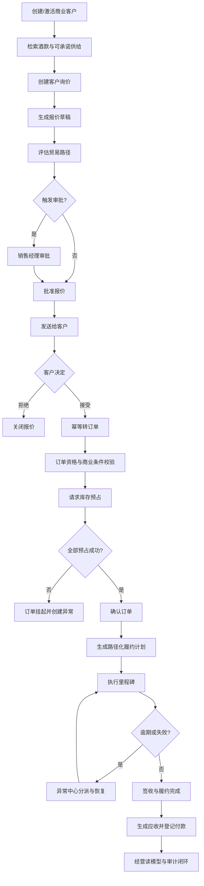

# 核心业务场景选择报告

## 1. 评价方法

候选场景按五个维度评分，满分 5 分：

- **证据匹配度 30%：** 与公开业务信息的直接关联；
- **Java 技术表现力 25%：** 能否自然展示事务、并发、DDD、事件和测试；
- **业务闭环 20%：** 是否从输入走到可验证结果；
- **评审便利性 15%：** 是否能在本地短时间运行和理解；
- **实施可控性 10%：** 在个人项目范围内能否完成且保持质量。

## 2. 候选场景

| 场景 | 证据匹配 | Java 表现 | 业务闭环 | 评审便利 | 实施可控 | 加权得分 |
|---|---:|---:|---:|---:|---:|---:|
| B2C 酒类商城 | 2 | 2 | 4 | 5 | 5 | 3.20 |
| 酒款内容搜索与推荐 | 4 | 2 | 2 | 4 | 4 | 3.10 |
| 海外代采管理 | 4 | 4 | 3 | 3 | 2 | 3.45 |
| 国际物流跟踪 | 4 | 3 | 3 | 4 | 3 | 3.50 |
| B2B 询报价到履约协同 | 5 | 5 | 5 | 4 | 4 | **4.70** |
| 完整 ERP/WMS/TMS 套件 | 4 | 5 | 5 | 1 | 1 | 3.75 |

## 3. 选择结果

选择 **B2B 询报价到履约协同**。原因不是它包含的页面最多，而是它能用一条业务叙事自然串联研究中最重要的事实：

- B2B 商业客户；
- 丰富酒款与内容；
- 在途、代采和多供给池；
- 上海、宁波、香港多路径；
- 商品、物流、清关、客户数字化；
- 供应链全链条服务。

## 4. 完整链路

## 5. 技术展示点与业务理由

| 技术点 | 业务理由 | 证明方式 |
|---|---|---|
| DDD 聚合与状态机 | 报价、订单和履约不能任意跳状态 | 纯领域单元测试和非法迁移测试 |
| 模块化单体 | 领域复杂但部署规模不需要微服务 | Spring Modulith + ArchUnit |
| 幂等 | 客户重复点击、网络重试不能重复下单 | Idempotency-Key + 唯一约束 + 重放测试 |
| 原子库存预占 | 多订单争抢同一批次时不能超卖 | 条件 UPDATE + 并发集成测试 |
| 事务性事件 | 订单提交与后续库存/履约解耦 | 持久化发布记录 + 故障恢复测试 |
| 可解释规则引擎 | 多路径选择需要理由和人工覆盖 | 规则结果、评分分解、策略版本 |
| CQRS 读模型 | 经营看板跨多个模块 | 事件投影与最终一致性展示 |
| OIDC/RBAC/ABAC | 不同岗位和客户可见字段不同 | 权限矩阵与越权测试 |
| React 企业工作台 | 评审者可操作完整链路 | Playwright 主路径和页面状态 |
| 可观测性 | 长流程失败需要定位和恢复 | trace、业务指标、结构化日志 |

## 6. 场景边界

### 进入核心版本

- 一个租户，多角色、多商业客户；
- 合成酒款、SKU、仓库和库存批次；
- 三个贸易路径模板；
- 报价规则、审批、接受和订单转换；
- 现货库存的全量预占；
- 路径化履约与异常；
- 简化应收与付款；
- 审计和经营看板。

### 延后

- 在途预售的自动承诺；
- 海外代采采购订单；
- 部分预占和拆单；
- 多仓跨路径组合；
- 退货、换货和索赔；
- 汇率实时服务；
- 高级定价和促销。

### 明确排除

- 真实酒类交易；
- 真实支付和开票；
- 真实海关申报；
- 真实承运商和仓库控制；
- 面向消费者的商城；
- 酒类推荐模型；
- 区块链溯源。

## 7. 成功标准

该场景只有在下列事实可被评审者独立验证时才算完成：

1. 同一已接受报价的并发转换只产生一个订单；
2. 多个并发订单对同一批次预占时从不超卖；
3. 事件处理失败后可重试，重复事件不产生重复副作用；
4. 非授权角色看不到成本和毛利，也不能跨租户访问；
5. 履约步骤非法跳转被拒绝；
6. 逾期步骤生成异常，并可分派、解决和恢复流程；
7. README、OpenAPI、状态机和实际行为一致；
8. 一个新评审者可以按脚本在本地完成完整链路。
