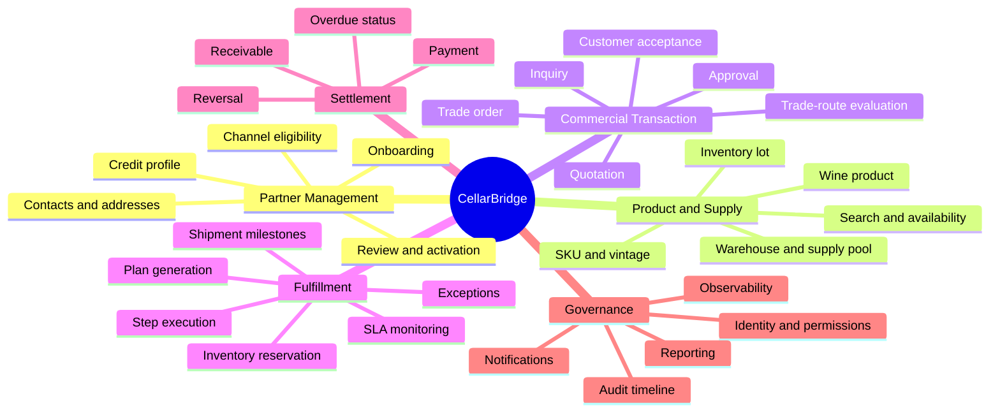
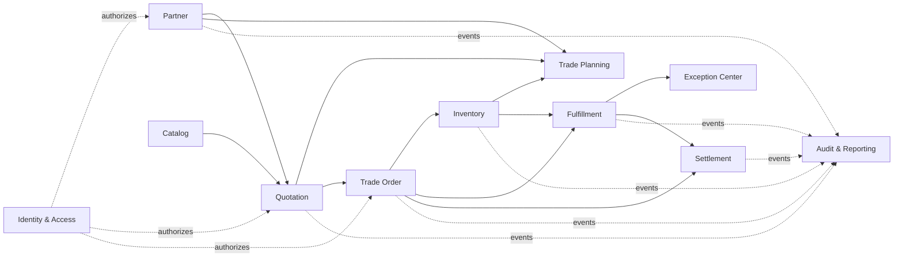

# 业务能力地图

## 1. 一级能力

## 2. 能力分解与模块归属

| 能力 ID | 一级能力 | 二级能力 | 责任模块 | P1 |
|---|---|---|---|---|
| CAP-IAM-01 | 身份与访问 | OIDC 登录与令牌校验 | identity-access | 是 |
| CAP-IAM-02 | 身份与访问 | 租户上下文 | identity-access | 是 |
| CAP-IAM-03 | 身份与访问 | 角色与权限判断 | identity-access | 是 |
| CAP-PAR-01 | 客户 | 客户档案 | partner | 是 |
| CAP-PAR-02 | 客户 | 审核、激活、停用 | partner | 是 |
| CAP-PAR-03 | 客户 | 路径资格 | partner | 是 |
| CAP-PAR-04 | 客户 | 信用与付款条款 | partner | 是，简化 |
| CAP-CAT-01 | 商品 | 酒款主数据 | catalog | 是 |
| CAP-CAT-02 | 商品 | SKU、年份和包装 | catalog | 是 |
| CAP-CAT-03 | 商品 | 内容标签与检索 | catalog | 是 |
| CAP-INV-01 | 库存 | 仓库与供给池 | inventory | 是 |
| CAP-INV-02 | 库存 | 库存批次和流水 | inventory | 是 |
| CAP-INV-03 | 库存 | 可用量查询 | inventory | 是 |
| CAP-INV-04 | 库存 | 原子预占、释放、消费 | inventory | 是 |
| CAP-QUO-01 | 报价 | 草稿与行项目 | quotation | 是 |
| CAP-QUO-02 | 报价 | 价格快照 | quotation | 是 |
| CAP-QUO-03 | 报价 | 商业规则和审批 | quotation | 是 |
| CAP-QUO-04 | 报价 | 发送、接受、拒绝、过期 | quotation | 是 |
| CAP-TRD-01 | 贸易规划 | 路径硬约束 | trade-planning | 是 |
| CAP-TRD-02 | 贸易规划 | 评分与推荐 | trade-planning | 是 |
| CAP-TRD-03 | 贸易规划 | 人工覆盖和策略版本 | trade-planning | 是 |
| CAP-ORD-01 | 订单 | 幂等报价转换 | trade-order | 是 |
| CAP-ORD-02 | 订单 | 商业快照与状态 | trade-order | 是 |
| CAP-ORD-03 | 订单 | 取消和挂起 | trade-order | 是 |
| CAP-FUL-01 | 履约 | 路径模板生成计划 | fulfillment | 是 |
| CAP-FUL-02 | 履约 | 步骤依赖和里程碑 | fulfillment | 是 |
| CAP-FUL-03 | 履约 | 公开时间线 | fulfillment | 是 |
| CAP-FUL-04 | 履约 | 外部适配器模拟 | fulfillment | 是 |
| CAP-EXC-01 | 异常 | 自动开单 | exception-center | 是 |
| CAP-EXC-02 | 异常 | 分派、处理和恢复 | exception-center | 是 |
| CAP-SET-01 | 结算 | 应收 | settlement | 是 |
| CAP-SET-02 | 结算 | 付款与部分付款 | settlement | 是 |
| CAP-SET-03 | 结算 | 冲正与逾期 | settlement | 是 |
| CAP-AUD-01 | 治理 | 不可变审计 | audit-reporting | 是 |
| CAP-REP-01 | 治理 | 经营读模型 | audit-reporting | 是 |
| CAP-NOT-01 | 治理 | 站内通知与工作队列 | notification | 是 |
| CAP-OBS-01 | 治理 | 技术与业务可观测性 | platform | 是 |

## 3. 核心、支撑和通用分类

| 类型 | 能力 | 设计重点 |
|---|---|---|
| 核心 | 报价、路径评估、订单、库存预占、履约 | 领域不变量、正确性和差异化 |
| 支撑 | 客户、目录、异常、应收 | 支持核心闭环，不扩展为独立大型系统 |
| 通用 | 身份、通知、审计、报表、可观测性 | 采用成熟机制，避免自建通用平台 |

## 4. 能力依赖

箭头表示业务信息依赖，不代表允许直接访问对方数据库。具体代码依赖规则见 `docs/03-architecture/02-module-dependency-rules.md`。

## 5. 能力成熟度目标

| 级别 | 定义 | P1 目标 |
|---|---|---|
| L0 | 仅文档描述 | 无 |
| L1 | 可执行 happy path | 所有 P1 能力 |
| L2 | 权限、验证、失败分支完整 | 所有核心能力 |
| L3 | 并发、幂等、恢复和可观测证据 | 订单、库存、履约、事件 |
| L4 | 性能、故障注入和发布证据 | 核心演示链路 |

公开 README 只按实际达到的级别描述能力。
