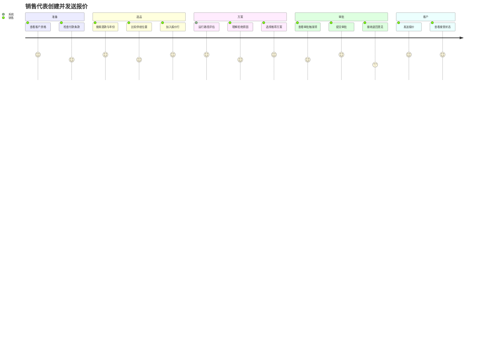

# 用户旅程

## 1. 端到端主旅程：从客户需求到可追踪交付

### 1.1 场景设定

成都区域的一家精品餐饮集团需要采购三款葡萄酒，用于四周后的季度菜单更新。客户希望了解国内现货与保税路径的价格和交付差异，并要求 30 天账期。销售代表需要在可控毛利和客户资格范围内给出报价。

所有姓名、公司、SKU、价格和数量均为合成演示数据。

### 1.2 旅程阶段

| 阶段 | 角色目标 | 系统接触点 | 系统承诺 | 失败与恢复 |
|---|---|---|---|---|
| 客户准备 | 确认客户能交易 | 客户档案、审核页 | 资格和付款条款有依据 | 未激活则阻止报价发送 |
| 发现供给 | 找到可满足需求的 SKU | 目录与供给搜索 | 区分现货、未来供给和信息时效 | 数据陈旧时提示刷新，不伪装承诺 |
| 创建报价 | 形成客户专属方案 | 报价编辑器 | 金额、路径、有效期可解释 | 无有效路径时显示逐条拒绝原因 |
| 审批 | 快速处理例外 | 审批工作台 | 触发原因、影响和历史清晰 | 退回后保留版本和意见 |
| 客户决定 | 理解并接受条款 | 客户报价页 | 重复点击不会重复接受 | 过期或版本变化返回明确状态 |
| 转订单 | 无重复录入 | 报价/订单时间线 | 一个报价最多一个订单 | 事件重试仍返回同一订单 |
| 预占库存 | 对承诺负责 | 订单库存面板 | 不超卖、全成或全败 | 不足时给出具体缺口并开异常 |
| 履约 | 推进跨角色工作 | 履约看板 | 步骤依赖、SLA、责任人明确 | 失败进入异常中心并可恢复 |
| 结算 | 完成商业闭环 | 应收页 | 部分付款和冲正可追踪 | 金额错误不修改历史，使用冲正 |
| 复盘 | 评价过程质量 | 驾驶舱、审计线 | 指标可追溯到事实 | 读模型延迟可观测 |

## 2. 销售代表旅程

### 2.1 目标

在 15 分钟内形成一份可发送的多 SKU 报价，清楚说明交付路径和有效期，并避免对不可兑现供给作出承诺。

### 2.2 操作路径



### 2.3 关键 UX 决策

- 报价编辑器按“客户—商品—路径—价格—审批”分区，而不是单一超长表单；
- 每次路径评估展示输入时间和策略版本；
- 被拒路径仍显示，但折叠展示原因，便于解释；
- 毛利和成本只对拥有字段权限的内部角色显示；
- 保存草稿不要求所有字段完整，提交审批必须完成全量校验；
- 发生并发编辑时返回当前版本和差异提示，不覆盖他人修改。

## 3. 销售经理旅程

### 3.1 目标

只处理真正超出政策的报价，并在一个页面看到商业影响、原因和历史。

### 3.2 决策卡片必须包含

- 客户名称、等级、信用状态和未结应收摘要；
- 报价总额、币种、预计毛利率和折扣；
- 触发的规则 ID、阈值、实际值；
- 推荐路径和销售选择；
- 若人工覆盖，显示推荐与覆盖差异及销售原因；
- 价格与路径策略版本；
- 批准、退回、拒绝动作及必填意见规则。

### 3.3 防误操作

- 按钮动作需要确认，但不使用模糊的“确定/取消”；
- 已被其他审批人处理时，刷新并显示最终决定；
- 审批者不能通过修改报价内容来隐式批准，修改需退回销售；
- 所有决定不可删除。

## 4. 客户采购旅程

### 4.1 目标

在不接触内部成本和复杂运营信息的前提下，确认商品、数量、总额、交付方式、预计日期、付款条款和有效期。

### 4.2 客户页信息边界

客户可见：

- 报价编号、版本、有效期；
- 商品快照、数量、单价和总额；
- 对外描述的交付方案和预计窗口；
- 付款条款；
- 接受/拒绝结果与订单编号；
- 公开履约里程碑和异常摘要。

客户不可见：

- 成本、毛利、内部折扣阈值；
- 其他候选路径及内部评分；
- 仓库批次细节；
- 内部异常调查、人员和评论；
- 其他客户或租户数据。

## 5. 贸易运营旅程

### 5.1 目标

从一个统一工作队列推进订单，不依赖聊天消息记忆当前步骤。

### 5.2 典型操作

1. 查看今天到期和已逾期的步骤；
2. 领取或开始任务；
3. 查看前置步骤、订单快照和相关附件元数据；
4. 完成步骤或报告失败；
5. 对失败选择“重试适配器、等待外部信息、调整计划、取消订单”等受控恢复路径；
6. 观察后继步骤是否自动解锁；
7. 在订单时间线确认公开里程碑已更新。

## 6. 仓库操作员旅程

- 只访问被分配仓库的预占和出库任务；
- 查看 SKU、批次、数量、库位和预占编号；
- 对出库执行幂等确认；
- 若批次不可用，不能直接替换为其他批次，需触发重新分配/异常流程；
- 扫码功能仅作为未来扩展，P1 使用可验证的手动确认。

## 7. 财务旅程

- 查看待创建应收、未付、部分支付、已付和逾期列表；
- 登记付款时使用外部参考号作为幂等键；
- 付款超过剩余应收时阻止提交；
- 错误记录通过冲正，再录入正确付款；
- 不允许直接编辑已入账金额；
- 成本和毛利仅在被授予字段权限时可见。

## 8. 审阅者旅程

技术审阅者不应先阅读所有代码。仓库提供以下证据链：

```text
业务场景
→ 功能需求 ID
→ 用例与状态机
→ 聚合不变量
→ OpenAPI / AsyncAPI 契约
→ 模块实现
→ 单元/集成/并发/E2E 测试
→ 运行指标和演示脚本
```

该旅程本身是产品设计的一部分：项目的目标不仅是“能运行”，还要“容易验证为什么正确”。
