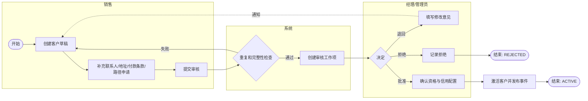
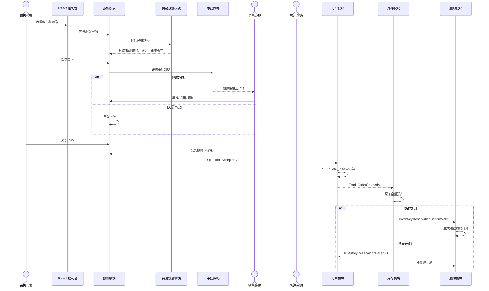
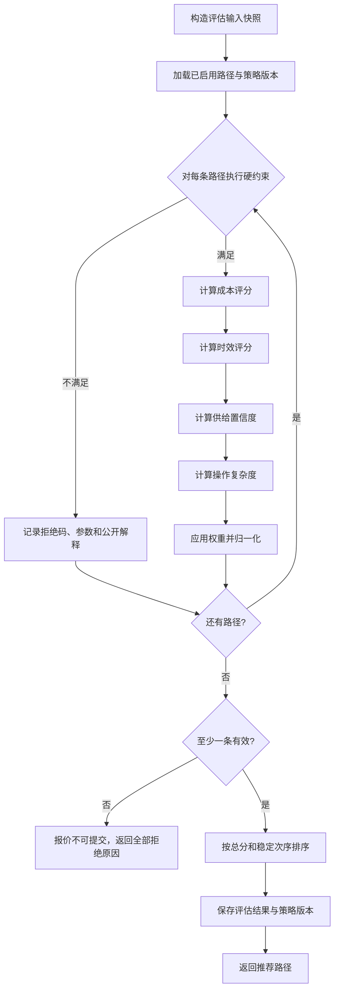
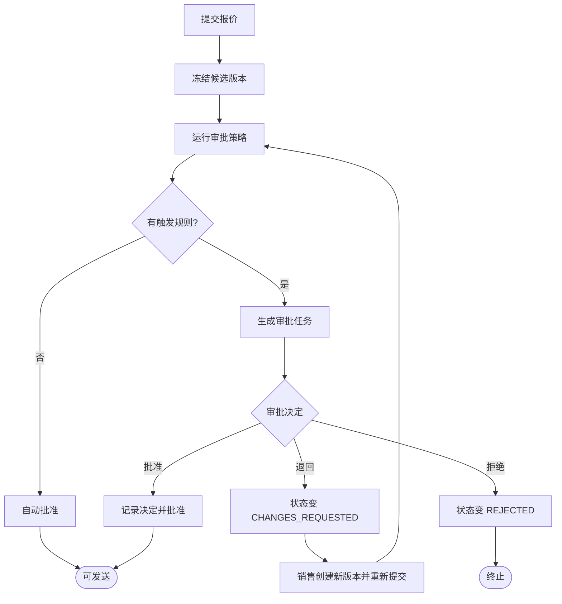
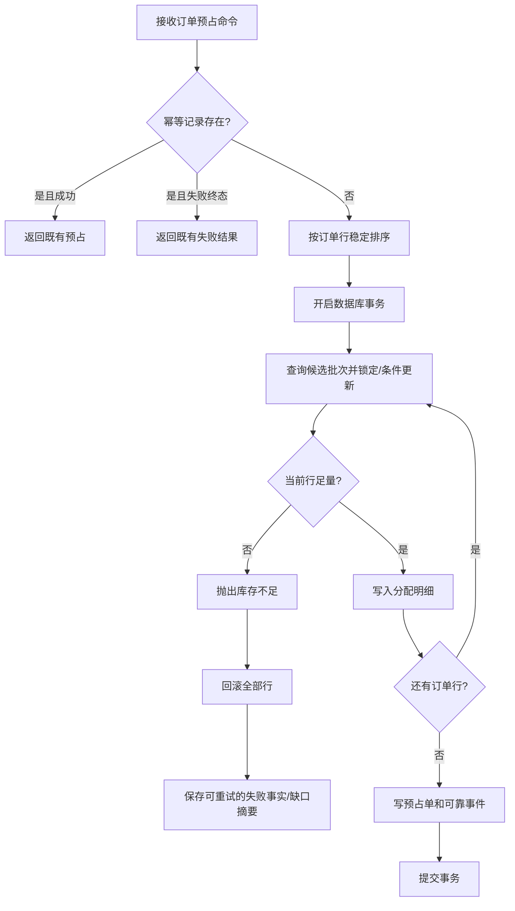
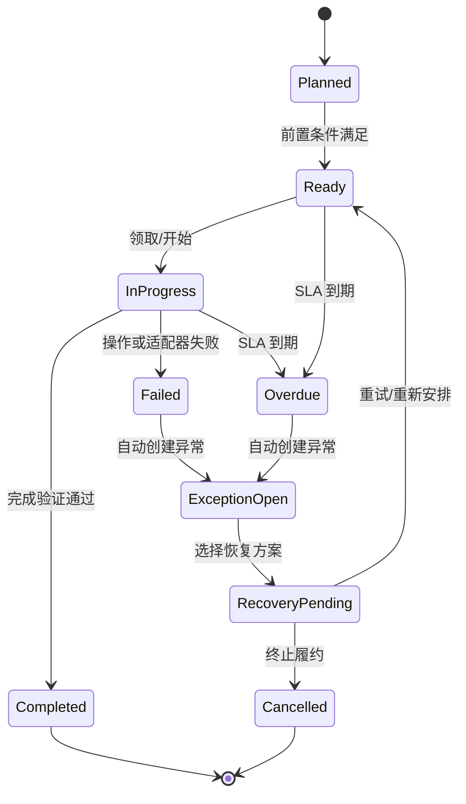
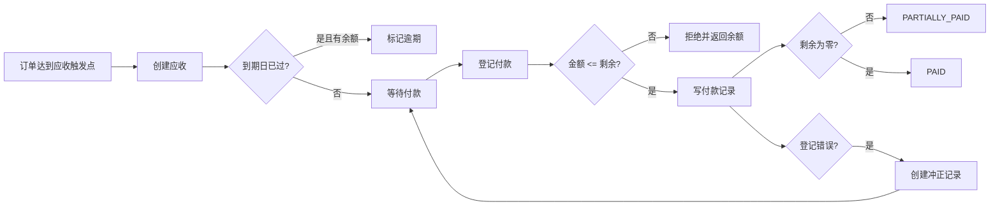

# 业务流程设计

## 1. 流程建模约定

本文使用接近 BPMN 的泳道和事件语义描述流程，但不依赖专用流程引擎。P1 使用领域状态机、应用服务和事件驱动编排实现；是否引入工作流引擎需要独立 ADR。

符号约定：

- 圆角节点：开始/结束事件；
- 矩形：人工或系统任务；
- 菱形：排他判断；
- 虚线：异步事件或通知；
- 补偿以显式业务命令实现，不采用分布式事务。

## 2. 客户准入流程



关键规则：提交人和审核人分离；客户停用立即阻止新报价，但不重写历史订单。

## 3. 报价到订单主流程



## 4. 贸易路径评估流程



### 4.1 硬约束示例

| 规则 ID | 规则 | 拒绝码 |
|---|---|---|
| TR-HARD-001 | 客户未获得路径资格 | `PARTNER_NOT_ELIGIBLE` |
| TR-HARD-002 | 目的地区域不被路径服务 | `DESTINATION_NOT_SUPPORTED` |
| TR-HARD-003 | 供给类型不匹配路径 | `SUPPLY_TYPE_NOT_SUPPORTED` |
| TR-HARD-004 | 预计交付晚于客户要求 | `DELIVERY_DATE_UNACHIEVABLE` |
| TR-HARD-005 | 数量低于路径最小起订 | `MOQ_NOT_MET` |
| TR-HARD-006 | 付款条款不被路径/客户策略允许 | `PAYMENT_TERM_NOT_ALLOWED` |

### 4.2 评分公式

P1 默认权重：

```text
总分 = 成本得分 × 0.40
     + 时效得分 × 0.30
     + 供给置信度 × 0.20
     + 操作简易度 × 0.10
```

所有子分数范围为 0~100；权重之和必须为 1；评分结果使用固定精度和稳定排序。改变权重创建新策略版本，不修改历史评估。

## 5. 报价审批流程



审批触发项包括：折扣超过阈值、预计毛利低于阈值、付款账期超出客户默认、选择非推荐路径、人工改价、特殊有效期。

## 6. 库存预占事务流程



P1 采用全量预占；不得在失败后保留部分行的预占。

## 7. 履约计划与异常流程



异常恢复动作必须具备：动作类型、参数、操作者、原因、前置状态、执行结果、重试计数和关联追踪 ID。

## 8. 应收与付款流程



## 9. 跨流程一致性边界

- 报价接受与订单创建不使用分布式事务；通过可靠事件、幂等键和重放实现最终一致；
- 订单创建与其可靠事件记录在同一本地事务；
- 库存预占的所有行在一个库存模块事务中全成或全败；
- 预占成功与履约计划创建最终一致；失败事件可重试，履约消费者幂等；
- 报表和审计投影允许短暂延迟，但必须暴露延迟指标；
- 任何流程失败都不得通过直接修改其他模块数据库恢复。
