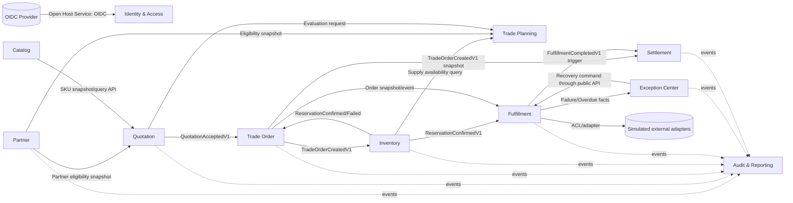

# 上下文地图

## 1. 限界上下文

CellarBridge 将交易链路拆为 11 个业务模块/限界上下文：

1. Identity & Access；
2. Partner；
3. Catalog；
4. Inventory；
5. Quotation；
6. Trade Planning；
7. Trade Order；
8. Fulfillment；
9. Exception Center；
10. Settlement；
11. Audit & Reporting。

通知与技术运维属于平台支撑能力，可作为小型模块存在，但不拥有核心商业事实。

## 2. 关系图

箭头代表公开 API、查询契约或事件关系，不允许直接访问数据库或 `internal` 包。

## 3. 上下文关系类型

| 上游 | 下游 | 关系 | 契约 | 说明 |
|---|---|---|---|---|
| OIDC Provider | Identity & Access | Open Host Service + Anti-Corruption Layer | OIDC/JWT | 将外部 claims 映射为本地用户与租户 |
| Partner | Quotation | Customer/Supplier | `PartnerCommercialSnapshot` | 报价保存当时客户状态和条款 |
| Catalog | Quotation | Published Language | `SkuSnapshot` | 避免引用 Catalog 内部实体 |
| Inventory | Trade Planning | Query Service | `SupplyAvailabilityView` | 只用于评估，不是预占承诺 |
| Quotation | Trade Planning | Customer/Supplier | `RouteEvaluationRequest/Result` | Trade Planning 不拥有报价生命周期 |
| Quotation | Trade Order | Published Event | `QuotationAcceptedV1` | 订单不反向读取报价表 |
| Trade Order | Inventory | Published Event/Command | `TradeOrderCreatedV1` / reservation API | 库存拥有预占规则 |
| Inventory | Fulfillment | Published Event | `InventoryReservationConfirmedV1` | 履约只在成功后生成计划 |
| Trade Order | Fulfillment | Conformist Snapshot | `OrderFulfillmentSnapshot` | 履约保存执行所需的订单快照 |
| Fulfillment | Exception Center | Published Event | `FulfillmentStepFailedV1` | 异常拥有处理工作，不拥有步骤状态 |
| Exception Center | Fulfillment | Public Command | `RetryStep`, `RescheduleStep` | 恢复通过源模块执行 |
| Trade Order | Settlement | Conformist Snapshot | `TradeOrderCreatedV1` | 结算保存客户、币种、金额和付款条款快照，不读取订单内部表 |
| Fulfillment | Settlement | Published Event | `FulfillmentCompletedV1` | 当前版本化触发策略以履约完成创建唯一应收 |
| All | Audit & Reporting | Event Consumer | versioned events | 读模型最终一致、幂等 |

## 4. 语义所有权

| 概念 | 唯一所有者 | 其他模块可保存 |
|---|---|---|
| 客户当前状态/资格 | Partner | 交易时快照、ID |
| SKU 当前主数据 | Catalog | 商品快照、ID |
| 批次和可用量 | Inventory | 显示投影，不可写 |
| 报价状态和接受 | Quotation | 接受事件/商业快照 |
| 路径评估规则 | Trade Planning | 评估结果快照 |
| 订单状态 | Trade Order | 订单 ID/履约快照 |
| 预占状态 | Inventory | 预占 ID/结果摘要 |
| 履约步骤 | Fulfillment | 公开里程碑投影 |
| 异常处理状态 | Exception Center | 异常 ID/关联摘要 |
| 应收余额 | Settlement | 报表投影 |
| 审计投影 | Audit & Reporting | 不反向成为源事实 |

## 5. 禁止关系

- Quotation 不直接查询 `inventory_lot` 表；
- Order 不读取 Quotation Repository 来“补字段”；接受事件必须足够；
- Fulfillment 不直接修改 Order 状态；发布里程碑由 Order 订阅决定；
- Exception Center 不直接把失败步骤改为 Ready；调用 Fulfillment 公共恢复命令；
- Reporting 不成为业务写入入口；
- Identity & Access 不在业务模块中散落 Keycloak SDK；只提供本地安全上下文；
- 不创建全局共享 `Customer`, `Product`, `OrderStatus` 实体供所有模块引用。

## 6. 提取路径

模块化单体并不承诺未来拆分，但保留可信边界：

- 模块表/迁移独立；
- 公开契约稳定；
- 跨模块 FK 禁止；
- 事件可序列化和版本化；
- 事务边界局部；
- 运行时指标可按模块分解。

只有在团队独立性、发布频率、资源隔离或负载差异形成证据后，才考虑提取模块。
