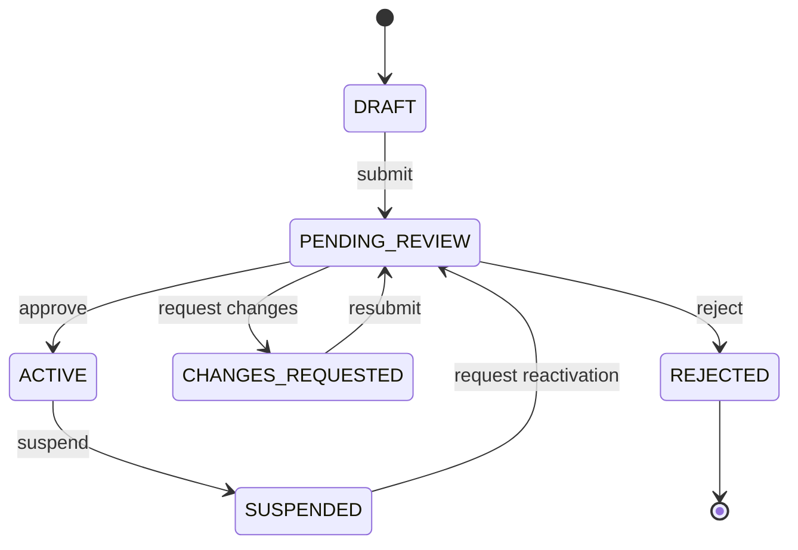
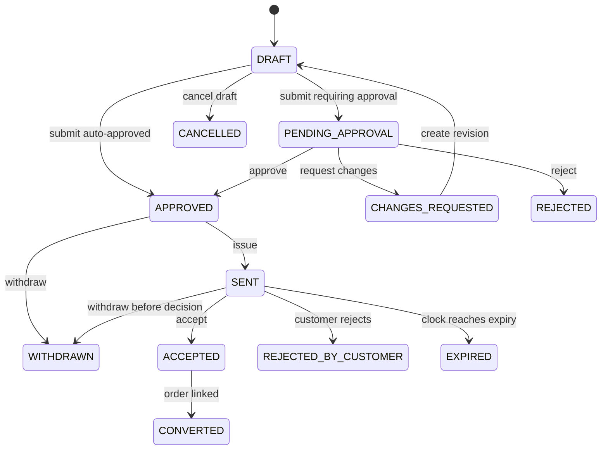
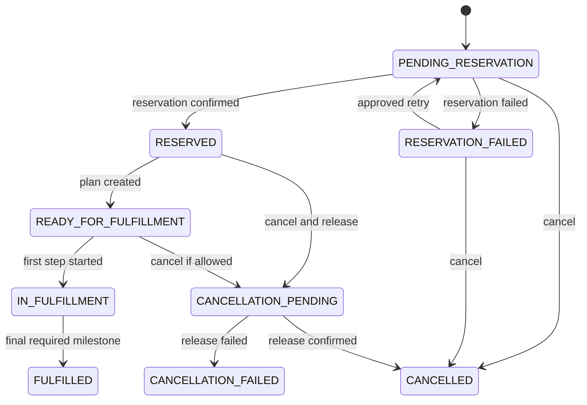
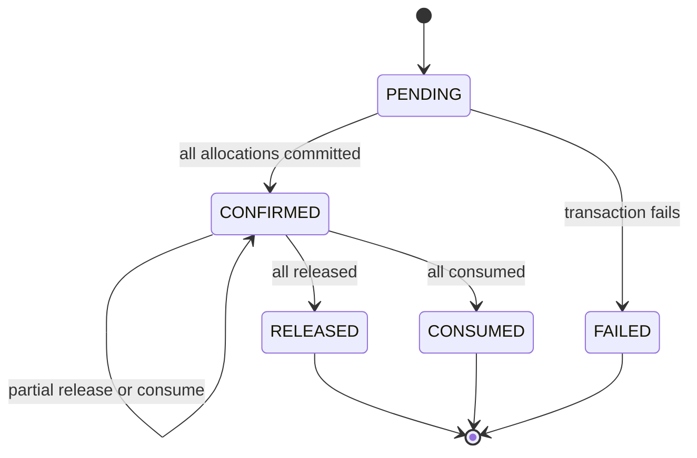
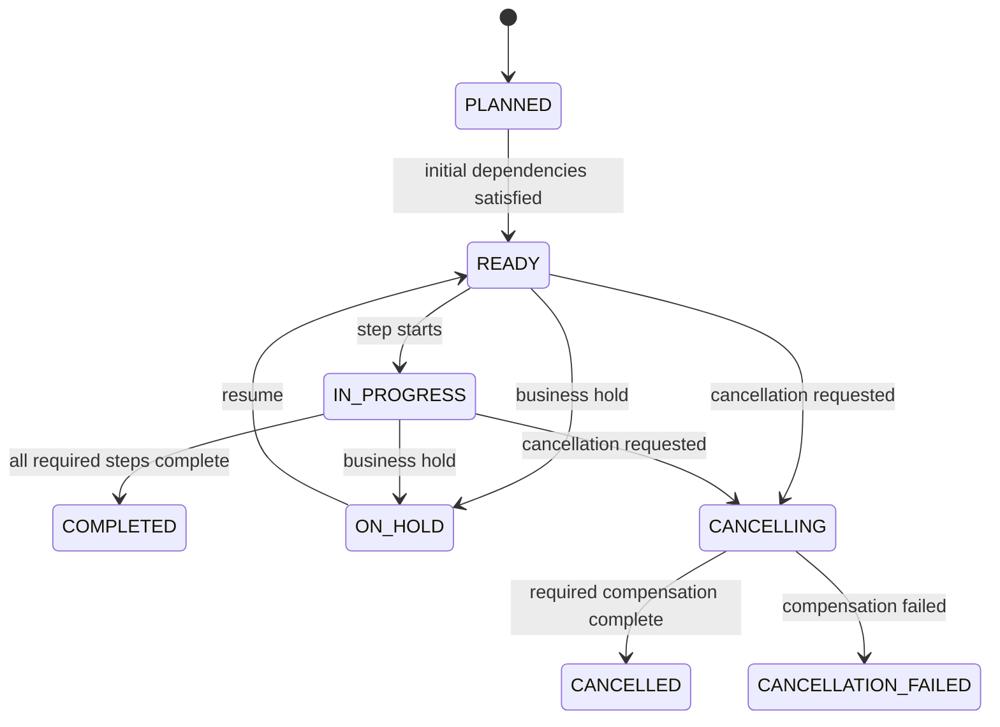
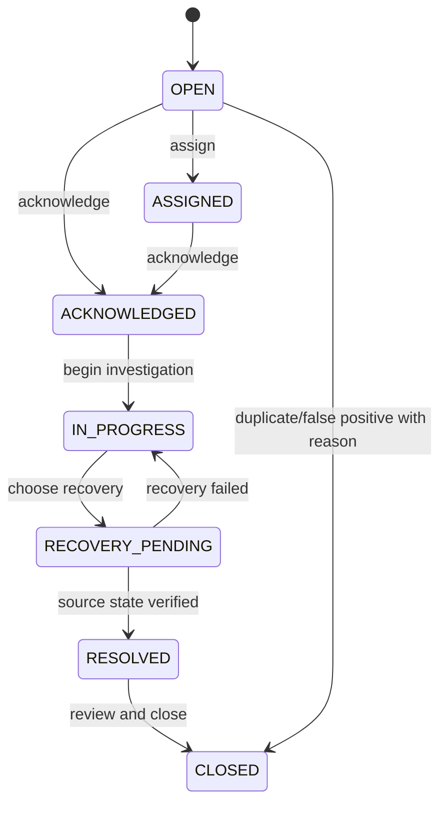
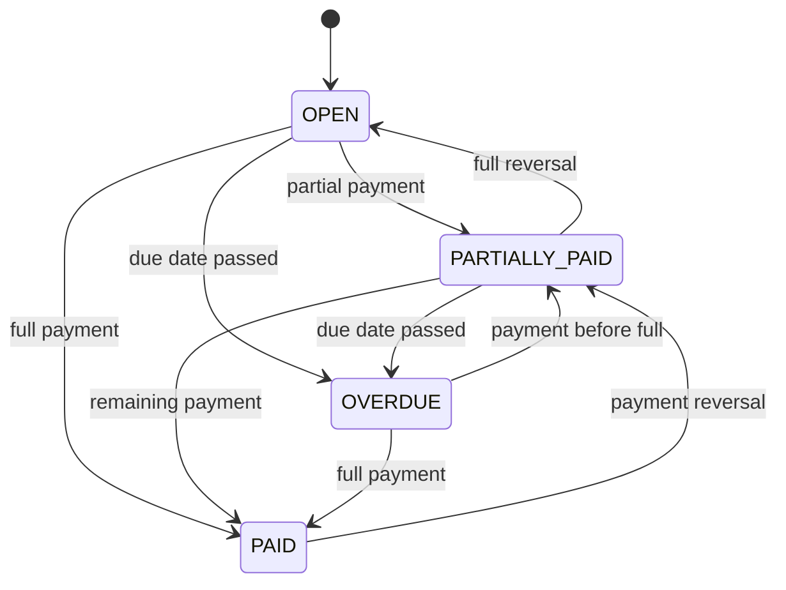

# 状态机

## 1. 状态机规则

- 每次转换由显式命令触发；
- 事件名称描述完成事实；
- 非法转换返回稳定冲突错误码；
- 重复终态命令按幂等约定返回既有结果；
- 不允许通过通用 `updateStatus` 绕过规则；
- 状态与领域时间由聚合在注入 `Clock` 下决定。

## 2. Partner

| From | Command | To | 关键条件 |
|---|---|---|---|
| DRAFT/CHANGES_REQUESTED | Submit | PENDING_REVIEW | 必填完整、无阻断重复 |
| PENDING_REVIEW | Approve | ACTIVE | 审核权限、双人原则 |
| PENDING_REVIEW | RequestChanges | CHANGES_REQUESTED | 原因必填 |
| PENDING_REVIEW | Reject | REJECTED | 原因必填 |
| ACTIVE | Suspend | SUSPENDED | 原因必填、保留历史 |

## 3. Quotation

状态对报价当前修订建模：

关键说明：

- `REJECTED`（内部审批拒绝）与 `REJECTED_BY_CUSTOMER` 区分；
- 报价到期由命令/调度显式落状态，接受命令同时执行即时过期判断；
- `ACCEPTED` 到 `CONVERTED` 最终一致；转换失败不撤销客户接受，而进入可恢复状态/告警；
- 已 ACCEPTED 不允许撤销，需订单取消流程处理。
- 修订另有正交供给决策状态：`UNDECIDED → FROZEN`；V13 前已有路线的修订升级为 `LEGACY_REEVALUATION_REQUIRED`。DRAFT Legacy 可重新评估进入 `FROZEN`，非 DRAFT Legacy 不静默升级。
- `submit`、`issue`、客户 `accept/reject` 只允许 `FROZEN`；冻结不触发库存 Reservation 或订单 `RESERVED`。

## 4. Trade Order

供给证据状态与订单状态正交：`FROZEN` 或 `LEGACY_UNVERIFIED` 都从 `PENDING_RESERVATION` 开始；Propagation 不执行任何 Reservation 转移。

不允许：FULFILLED 普通取消；直接从 PENDING_RESERVATION 到 FULFILLED；预占失败后自动无限重试。

## 5. Inventory Reservation

部分操作通过 Allocation 的 released/consumed/remaining 数量表达，Reservation 聚合保持 `CONFIRMED`；同一 Reservation 不混用 release 与 consume，余额全部归零后才进入 `RELEASED` 或 `CONSUMED`。

## 6. Fulfillment Plan

步骤状态：`BLOCKED`, `READY`, `IN_PROGRESS`, `COMPLETED`, `FAILED`, `OVERDUE`, `CANCELLED`, `SKIPPED`。`SKIPPED` 只在模板声明可选且理由存在时允许。

## 7. Exception Case

## 8. Receivable

状态是余额与时间的派生/受控状态，调度重复执行安全。

## 9. 状态转换错误

统一错误：

- `INVALID_STATE_TRANSITION`；
- `RESOURCE_VERSION_CONFLICT`；
- 领域专用错误如 `QUOTE_NOT_ACCEPTABLE`、`ORDER_CANNOT_BE_CANCELLED`。

错误响应应包含当前状态、请求动作和允许动作（不泄露权限外信息），便于 UI 恢复。
