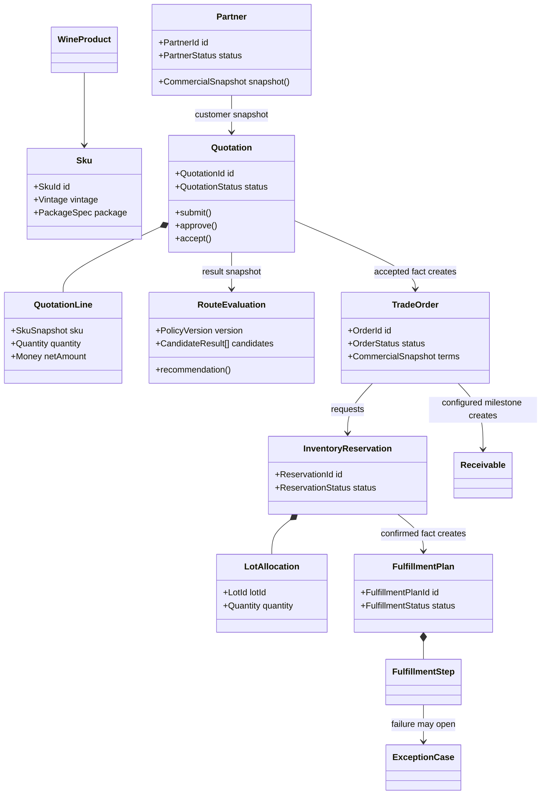
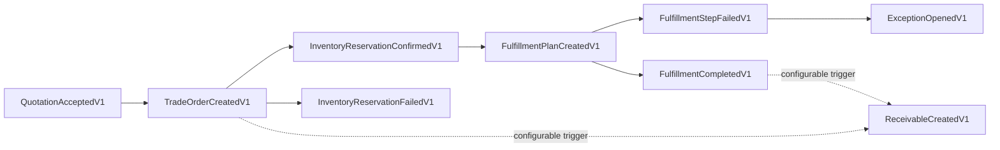
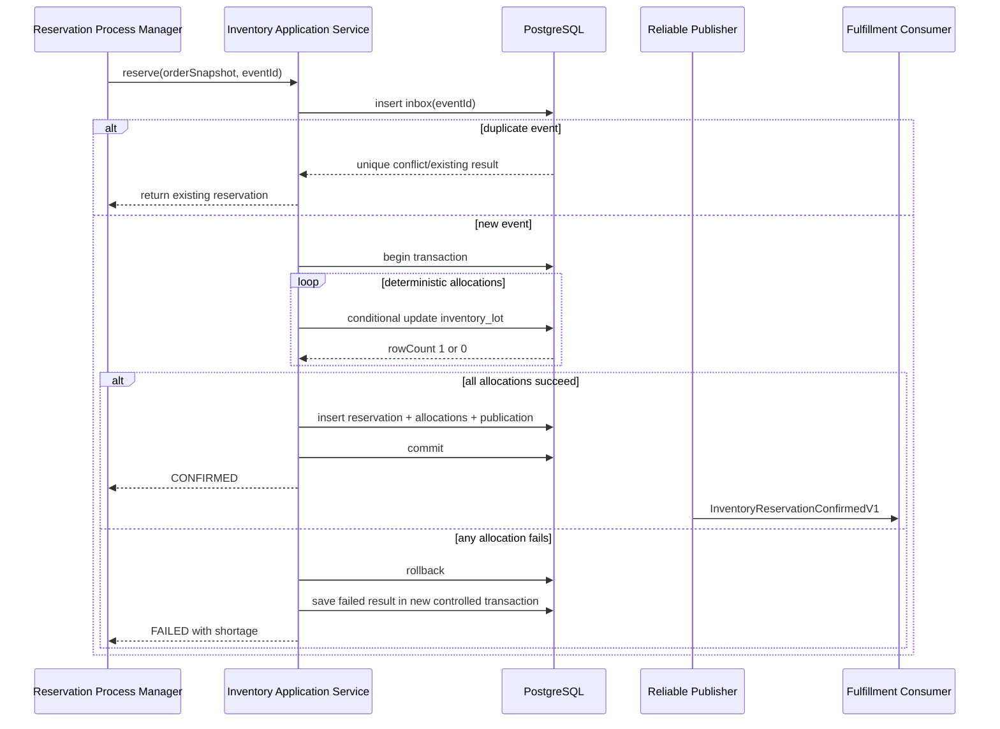
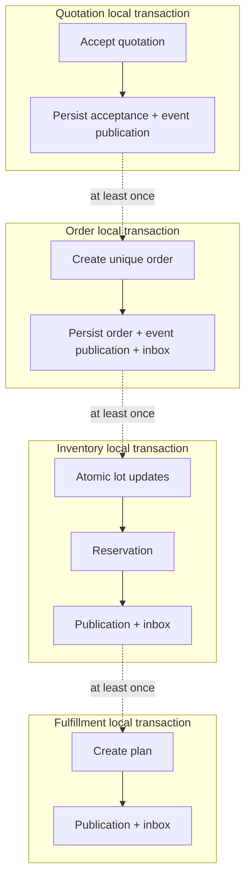
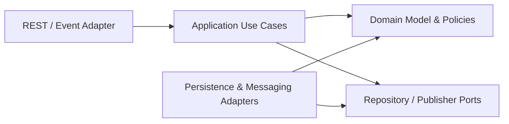

# 领域图集

## 1. 核心领域关系（概念图）

```mermaid
classDiagram
    class Partner {
      +PartnerId id
      +PartnerStatus status
      +CommercialSnapshot snapshot()
    }
    class WineProduct
    class Sku {
      +SkuId id
      +Vintage vintage
      +PackageSpec package
    }
    class Quotation {
      +QuotationId id
      +QuotationStatus status
      +submit()
      +approve()
      +accept()
    }
    class QuotationLine {
      +SkuSnapshot sku
      +Quantity quantity
      +Money netAmount
    }
    class RouteEvaluation {
      +PolicyVersion version
      +CandidateResult[] candidates
      +recommendation()
    }
    class TradeOrder {
      +OrderId id
      +OrderStatus status
      +CommercialSnapshot terms
    }
    class InventoryReservation {
      +ReservationId id
      +ReservationStatus status
    }
    class LotAllocation {
      +LotId lotId
      +Quantity quantity
    }
    class FulfillmentPlan {
      +FulfillmentPlanId id
      +FulfillmentStatus status
    }
    class FulfillmentStep
    class ExceptionCase
    class Receivable

    Partner --> Quotation : customer snapshot
    WineProduct --> Sku
    Quotation *-- QuotationLine
    Quotation --> RouteEvaluation : result snapshot
    Quotation --> TradeOrder : accepted fact creates
    TradeOrder --> InventoryReservation : requests
    InventoryReservation *-- LotAllocation
    InventoryReservation --> FulfillmentPlan : confirmed fact creates
    FulfillmentPlan *-- FulfillmentStep
    FulfillmentStep --> ExceptionCase : failure may open
    TradeOrder --> Receivable : configured milestone creates
```

关系表示业务因果或快照，不代表 ORM 跨模块关联。

## 2. 报价到履约事件链

```mermaid
flowchart LR
    QA[QuotationAcceptedV1]
    OC[TradeOrderCreatedV1]
    RC[InventoryReservationConfirmedV1]
    RF[InventoryReservationFailedV1]
    PC[FulfillmentPlanCreatedV1]
    SF[FulfillmentStepFailedV1]
    EO[ExceptionOpenedV1]
    FC[FulfillmentCompletedV1]
    RR[ReceivableCreatedV1]

    QA --> OC
    OC --> RC
    OC --> RF
    RC --> PC
    PC --> SF
    SF --> EO
    PC --> FC
    OC -.configurable trigger.-> RR
    FC -.configurable trigger.-> RR
```

## 3. 库存预占时序

```mermaid
sequenceDiagram
    participant PM as Reservation Process Manager
    participant APP as Inventory Application Service
    participant DB as PostgreSQL
    participant PUB as Reliable Publisher
    participant FUL as Fulfillment Consumer

    PM->>APP: reserve(orderSnapshot, eventId)
    APP->>DB: insert inbox(eventId)
    alt duplicate event
      DB-->>APP: unique conflict/existing result
      APP-->>PM: return existing reservation
    else new event
      APP->>DB: begin transaction
      loop deterministic allocations
        APP->>DB: conditional update inventory_lot
        DB-->>APP: rowCount 1 or 0
      end
      alt all allocations succeed
        APP->>DB: insert reservation + allocations + publication
        APP->>DB: commit
        APP-->>PM: CONFIRMED
        PUB->>FUL: InventoryReservationConfirmedV1
      else any allocation fails
        APP->>DB: rollback
        APP->>DB: save failed result in new controlled transaction
        APP-->>PM: FAILED with shortage
      end
    end
```

## 4. 关键一致性分区

```mermaid
flowchart TB
    subgraph QuoteTx[Quotation local transaction]
      Q[Accept quotation]
      QE[Persist acceptance + event publication]
      Q --> QE
    end
    subgraph OrderTx[Order local transaction]
      O[Create unique order]
      OE[Persist order + event publication + inbox]
      O --> OE
    end
    subgraph InventoryTx[Inventory local transaction]
      L1[Atomic lot updates]
      R[Reservation]
      IE[Publication + inbox]
      L1 --> R --> IE
    end
    subgraph FulfillmentTx[Fulfillment local transaction]
      P[Create plan]
      FE[Publication + inbox]
      P --> FE
    end

    QE -.at least once.-> O
    OE -.at least once.-> L1
    IE -.at least once.-> P
```

## 5. 模块内部层次

```mermaid
flowchart LR
    REST[REST / Event Adapter]
    APP[Application Use Cases]
    DOM[Domain Model & Policies]
    PORT[Repository / Publisher Ports]
    INF[Persistence & Messaging Adapters]

    REST --> APP
    APP --> DOM
    APP --> PORT
    INF --> PORT
    INF --> DOM
```

依赖指向领域/端口；Spring 配置在 internal infrastructure；跨模块只依赖公开 API/events。
