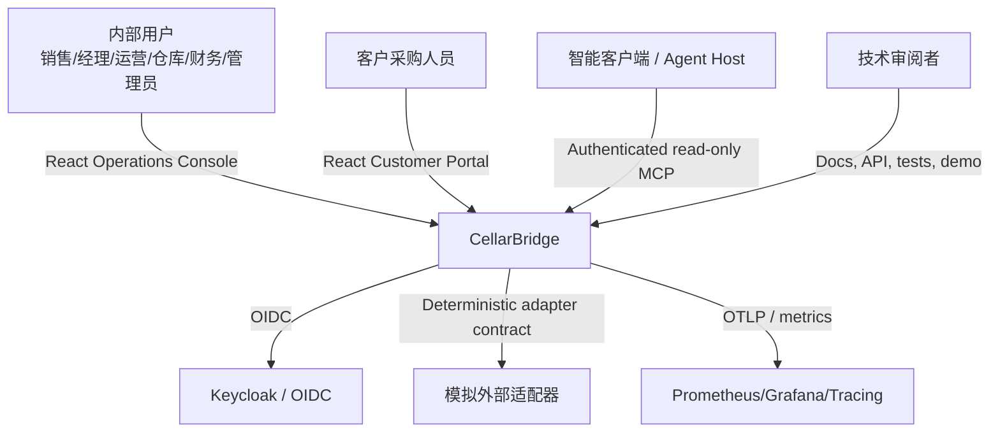
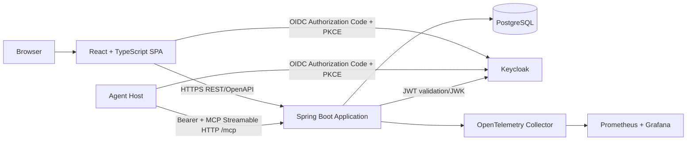
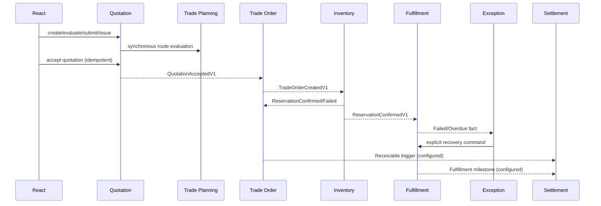

# 架构总览

## 1. 架构目标

CellarBridge 的架构服务于四个目标：

1. **业务正确性可证明**：报价、订单、库存和履约的关键不变量有明确事务与测试；
2. **边界可审阅**：模块所有权、公开 API、事件、表和依赖方向清晰；
3. **本地可运行**：审阅者不依赖私有云或复杂集群即可运行主链路；
4. **演进有依据**：中间件和分布式拆分只在有业务/运行证据时引入。

## 2. 架构风格

采用 **领域导向模块化单体（domain-oriented modular monolith）**：

- 一个后端部署单元；
- 多个具备明确数据和代码所有权的业务模块；
- 同一模块内可使用强事务；
- 跨模块通过公开 Java API、显式查询契约和可靠事件协作；
- Spring Modulith 负责模块发现、验证和模块测试；当前可靠发布由自定义本地 publication/Inbox 实现；
- ArchUnit 补充层次、命名和禁止依赖规则。

这不是“以后一定拆微服务”的过渡代码，也不是一个按 Controller/Service/Repository 横向分层的大泥球。

## 3. 系统上下文



## 4. 容器视图



### Core profile

PostgreSQL + Keycloak + Spring Boot + React。`/mcp` 与 REST API 位于同一个 Spring Boot
部署单元，跨模块事件由持久化的本地可靠发布机制处理，适合快速启动和主演示。

### Full profile（Available）

在 core 基础上增加 OpenTelemetry Collector、Tempo、Prometheus 和 Grafana，用于展示
trace、metrics、logs 与告警。Kafka、Redis 均未安装，任何 full profile 组件都不是 core
业务正确性的依赖。

## 5. 后端模块

```text
identity-access
partner
catalog
inventory
quotation
trade-planning
trade-order
fulfillment
exception-center
settlement
audit-reporting
notification (supporting)
platform (technical adapters only)
```

模块划分按业务语言，不按技术类型。模块可具有自己的 `internal.domain`、`internal.application`、`internal.infrastructure` 和 `internal.interfaces`。

## 6. 主链路

Task 01～12 已实现从 `QuotationAcceptedV1` 到订单、库存、履约、异常、结算和报表投影的
完整主演示链路。Task 16 只在这些既有应用用例之上增加读取适配器，不创建第二套业务逻辑。



同步调用只用于需要即时结果且边界稳定的场景，例如报价调用路径评估。长流程使用事件，避免跨模块长事务。

## 7. 数据架构

- 一个 PostgreSQL 实例，按模块 schema 分区；
- 模块只访问自己 schema；
- 不创建跨模块外键；使用稳定 ID + 必要不可变快照；
- 写模型规范化，读模型按页面投影；
- Flyway 迁移按模块路径；
- JSONB 只用于事件 envelope、策略/商业快照和变化较低的证据，不替代核心关系字段；
- 时间 UTC、金额固定精度、版本列乐观并发。

## 8. 一致性

| 场景 | 一致性方式 |
|---|---|
| 报价修订、审批、接受 | 单聚合本地事务 |
| 报价接受 → 订单 | 可靠事件 + quote 唯一键 + Inbox |
| 订单 → 库存预占 | 可靠事件 + 库存本地事务 |
| 多订单行预占 | 单库存事务，全成全败 |
| 预占 → 履约计划 | 可靠事件 + order 唯一计划 |
| 履约失败 → 异常 | 至少一次 + 异常去重键 |
| 业务 → 报表/时间线 | 最终一致投影 |
| MCP 读取 → 业务数据 | 同步调用既有应用服务；不直接读跨模块表 |

## 9. 安全

- OIDC Authorization Code + PKCE；
- 后端 Resource Server 验证 JWT；
- 本地权限码和租户映射；
- 查询和写入均包含租户谓词；
- 角色 + 所有权 + 状态 + 字段安全；
- 客户门户使用独立 audience/角色和受控公开 token；
- 敏感日志、事件和 API 最小化；
- 双租户集成测试为发布门槛。
- `/mcp` 复用同一 JWT audience、TenantContext、权限码、所有权和字段投影；
- MCP 不接受 `tenantId`/`actorId` 参数，专用 Origin/CORS 白名单拒绝不受信浏览器来源；
- MCP tools 全部只读，错误使用安全 envelope，响应禁止缓存。

## 10. 质量证据

当前已有：Spring Modulith verification、ArchUnit 规则、聚合/集成/并发测试、契约校验、
真实 OIDC Playwright、完整事件重放、结构化 telemetry、SBOM、镜像扫描，以及 MCP 集成、
真实 OIDC smoke 和官方协议 conformance。

- Spring Modulith `verify()`；
- ArchUnit 依赖规则；
- 聚合单元测试；
- Testcontainers PostgreSQL 集成测试；
- 并发库存与订单幂等测试；
- OpenAPI/AsyncAPI/schema 校验；
- Playwright 主流程；
- 故障恢复和事件重放测试；
- 结构化指标、日志和 trace；
- SBOM、依赖和镜像扫描；
- MCP 6/3/3 discovery、鉴权/租户/字段边界、smoke 与 conformance。

## 11. 架构限制

- P1 不实现真实海关/税务规则；
- P1 不连接真实支付、WMS、TMS；
- 不声称生产级多区域高可用；
- 不为展示拆微服务；
- 不把 Redis 或 Kafka 作为库存正确性的必要条件；
- 不将报表投影当写入事实。
- 不通过 MCP 执行业务写入，也不在服务端托管模型、RAG 或向量库；
- Agent Host 和它连接的模型位于 CellarBridge 信任边界之外，生产接入需独立治理。
