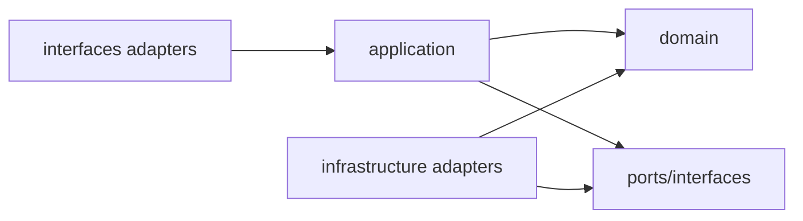

# 分层与包结构

## 1. 当前仓库结构

```text
cellarbridge-platform/
├── backend/
│   ├── pom.xml
│   ├── .mvn/ + mvnw
│   └── src/                    单 Maven module，按 Java package 保持业务模块边界
├── frontend/
│   ├── package.json
│   ├── pnpm-lock.yaml
│   └── src/
├── contracts/
├── deploy/
├── docs/
└── scripts/
```

推荐先使用单 Spring Boot Maven module + 严格 Java package 模块。只有构建隔离、生成代码或启动时间有明确收益时再拆 Maven modules，避免双重模块化复杂度。

## 2. 后端包结构

```text
com.rom.cellarbridge
├── CellarBridgeApplication.java
├── identityaccess/
├── partner/
├── catalog/
├── inventory/
├── quotation/
├── tradeplanning/
├── tradeorder/
├── fulfillment/
├── exceptioncenter/
├── settlement/
├── auditreporting/
├── notification/
└── platform/
```

每个业务模块：

```text
quotation/
├── QuotationModuleApi.java
├── QuotationQueries.java
├── package-info.java
├── events/
│   └── QuotationAcceptedV1.java
├── types/
│   └── QuotationId.java
└── internal/
    ├── application/
    │   ├── command/
    │   ├── query/
    │   └── process/
    ├── domain/
    │   ├── model/
    │   ├── policy/
    │   ├── service/
    │   └── event/
    ├── infrastructure/
    │   ├── persistence/
    │   │   ├── jpa/
    │   │   ├── jdbc/
    │   │   └── migration-notes/
    │   ├── messaging/
    │   └── configuration/
    └── interfaces/
        ├── rest/
        └── event/
```

## 3. 依赖方向



- Domain 不依赖 Spring Web、JPA、Kafka、Redis；可使用极少非侵入注解需有决定；
- Application 依赖领域和端口；
- Infrastructure 实现端口；
- REST/Event adapters 调用应用用例；
- Spring configuration 组装依赖。

## 4. 持久化模型

当前实现使用 Spring JDBC / SQL-first，并以显式 record/mapper 隔离领域与持久化。JPA 未安装，只是 ADR-012 约束的未来可选 adapter：

1. 当前聚合、Inventory、事件和读模型使用独立 persistence record + mapper/JDBC；
2. 未来简单聚合只有在收益和 canonical write path 被明确审阅后才可选择 JPA，且注解不得泄露到公开契约；
3. 同一聚合不得在没有迁移/对账/切换协议时混用 JPA 与 JDBC 写模型。

禁止为了“纯洁”制造大量无价值复制，也禁止让 JPA lazy loading 决定聚合边界。

## 5. DTO

- Request/Response DTO 在 `interfaces.rest`；
- Application command/result 在 `application`；
- Domain value objects 在 `domain`；
- Module public contract 在模块公开包；
- generated OpenAPI TypeScript 类型在 frontend generated 目录；
- 不使用一个全局 `CommonResponse<T>` 包装所有响应；遵循标准 HTTP 和 Problem Details。

## 6. 前端结构

```text
src/
├── app/                    routing, providers, shell
├── features/
│   ├── partners/
│   ├── catalog/
│   ├── quotations/
│   ├── orders/
│   ├── fulfillment/
│   ├── exceptions/
│   ├── settlement/
│   └── dashboard/
├── shared/
│   ├── api/generated/
│   ├── auth/
│   ├── components/
│   ├── errors/
│   └── formatting/
├── test/
└── main.tsx
```

`shared` 只放跨功能稳定 UI/技术能力；业务组件留在 feature。禁止每个页面各自手写 fetch、权限和错误解析。

## 7. 命名

- Java 包全小写；
- 类使用业务术语，不使用 `Helper`, `Util`, `Manager` 模糊名称；
- 命令为动词；事件为过去时；查询为 `Get/List/Search`；
- Repository 以聚合为中心，不为每张表创建 Repository；
- SQL 文件和迁移包含模块前缀；
- React 组件/Hook 使用业务意图，例如 `QuotationRouteDecisionPanel`。

## 8. 生成代码

- OpenAPI client/types 放 `frontend/src/shared/api/generated`；
- 生成命令确定、版本固定；
- CI 校验重新生成后无差异；
- 生成目录不手改；
- 后端接口可 contract-first 或受控 code-first，但 OpenAPI 文件是审阅基线，破坏变化必须显式。
