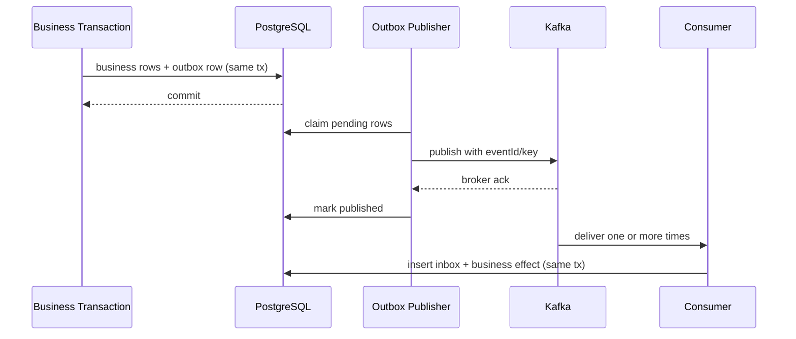

# 事件与可靠发布

## 1. 目标

保证“业务事务已提交但应用崩溃”时后续协作不会永久丢失，同时接受重复交付并通过幂等消除重复副作用。

保证语义：

- 本地业务状态与发布记录原子；
- 发布为至少一次，不承诺 exactly-once；
- 消费者按 event ID 幂等；
- 处理失败可观察、可重试、可人工重放；
- 事件契约版本化。

## 2. 本地模块事件

优先使用 Spring Modulith 的持久化事件发布注册表支持跨模块监听：

1. 聚合/应用发布模块事件；
2. 业务事务提交时持久记录待完成 listener publication；
3. listener 成功后标记完成；
4. 未完成可在重启后重试/重新提交；
5. 模块集成测试验证 listener 边界。

具体 API 以锁定版本官方文档为准，不能依赖内部未承诺实现。

## 3. 外部 Kafka 事件

full profile 使用 external outbox adapter：

Kafka topic 不是模块边界的替代；topic 名称和 schema 在 AsyncAPI。

## 4. Event Envelope

必填：

- `id` UUID；
- `type`，如 `cellarbridge.quotation.accepted.v1`；
- `specVersion`；
- `occurredAt`；
- `tenantId`（外部 demo 可使用不可逆/合成 ID）；
- `subjectType`、`subjectId`；
- `producer`；
- `correlationId`、`causationId`；
- `payload`；
- `schemaRef`/contentType。

事件不包含数据库 Entity 序列化结果。

## 5. 分区与顺序

Kafka key 默认为 `tenantId + subjectType + subjectId`，使同一业务对象尽量顺序。消费者仍必须处理：

- 重复；
- 延迟；
- 不同对象间乱序；
- 旧版本事件；
- 重放。

需要前置状态的消费者应使用状态机/版本判断；不满足时可延迟重试或进入异常，不直接跳转。

## 6. Publisher 领取

- 使用 `FOR UPDATE SKIP LOCKED` 批量领取；
- 每批有大小和锁超时；
- claim 包含 owner/lease 到期，崩溃可回收；
- 发布成功和失败计数；
- broker ack 后标记 published 的窗口可能重复，因此消费者幂等；
- payload 不可在重试时修改。

## 7. Consumer Inbox

表唯一键 `(consumer_name, event_id)`。处理模式：

1. 开事务；
2. 尝试 insert PROCESSING；
3. 重复则读取已有状态；
4. 执行业务副作用；
5. 标记 PROCESSED、保存 result hash；
6. 提交。

长时间处理不在数据库事务内执行外部网络；拆成内部命令/任务。

## 8. 重试与失败

- 瞬时失败：指数退避 + 抖动；
- 业务冲突：不无限重试，创建异常/人工处理；
- schema/契约错误：FAILED_FINAL + 高严重度指标；
- Kafka 不可用：outbox 保留 PENDING，业务 core 流程可继续到本地状态；
- backlog 有数量和最老年龄指标；
- 手动重放需要 `event-publication:replay` 和审计。

## 9. Schema 兼容

- JSON Schema/AsyncAPI 校验；
- 生产者契约测试；
- 消费者 fixture 测试；
- 新字段可选并有默认处理；
- 不兼容改动创建 v2 事件和迁移窗口；
- 旧消费者未知字段忽略；
- 枚举扩展需消费者有 UNKNOWN/安全失败策略。

## 10. 监控

指标：

- pending publication count/age；
- publish rate/failure/retry；
- consumer lag；
- inbox duplicate count；
- handler duration/error by type；
- failed final count；
- reconciliation anomalies。

trace 使用 message span link 连接 producer/consumer，不假设同步父子关系。
