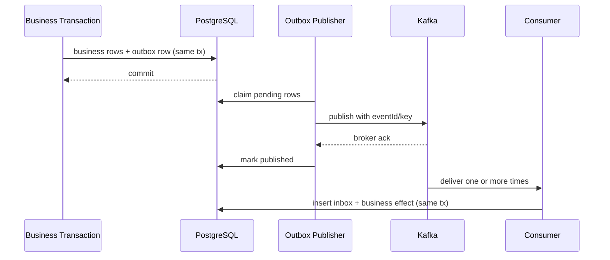

# 事件与可靠发布

## 1. 目标

保证“业务事务已提交但应用崩溃”时后续协作不会永久丢失，同时接受重复交付并通过幂等消除重复副作用。

保证语义：

- 本地业务状态与发布记录原子；
- 发布为至少一次，不承诺 exactly-once；
- 消费者按 event ID 幂等；
- 处理失败可观察、可有限重试；人工重放是后续受控能力；
- 事件契约版本化。

## 2. 本地模块事件

状态：**Available**。当前 core 使用自定义本地可靠 publication 与 Consumer Inbox；Spring Modulith 用于模块发现、验证和模块测试，不使用其 Event Publication Registry。

1. 聚合/应用通过 `ReliableEventPublisher` 在业务事务内写入 `platform_event.event_publication`；
2. 本地 dispatcher 查询 ready publication 并调用 `LocalEventHandler`；当前没有 publication lease/claim，重复并发由 Consumer Inbox 与业务唯一约束消除副作用；
3. 每个 Consumer 以 `(consumer_name, event_id)` 的 Inbox 状态独立去重；
4. 业务副作用、Inbox 完成和后继 publication 在同一本地事务提交；
5. 重复投递无害，基础设施保存 `FAILED_RETRYABLE` 或 `FAILED_FINAL`。当前两个 handler 仍把宽泛 `NullPointerException` 误归为契约失败，这是本 core correction 达到 Ready 前必须修复的已知偏差。

语义是 at-least-once，不宣称 exactly-once。retention、reconciliation、人工 replay 和完整指标仍需后续交付。

## 3. 外部 Kafka 事件（Planned full profile）

未来 full profile 使用独立 external-outbox adapter；当前没有 Kafka 运行依赖或 broker acknowledgement：

Kafka topic 不是模块边界的替代；topic 名称和 schema 在 AsyncAPI。本地 Consumer Inbox 完成不等于 broker ack，二者不得共用发布状态。

## 4. Event Envelope

必填：

- `id` UUID；
- `type`，如 `cellarbridge.quotation.accepted.v1`；
- `specVersion`；
- `occurredAt`；
- `tenantId`（外部 demo 可使用不可逆/合成 ID）；
- `subjectType`、`subjectId`；
- `producer`；
- `correlationId`、`causationId`；
- `payload`；
- `schemaRef`/contentType。

事件不包含数据库 Entity 序列化结果。

## 5. 分区与顺序（Planned Kafka）

Kafka key 默认为 `tenantId + subjectType + subjectId`，使同一业务对象尽量顺序。消费者仍必须处理：

- 重复；
- 延迟；
- 不同对象间乱序；
- 旧版本事件；
- 重放。

需要前置状态的消费者应使用状态机/版本判断；不满足时可延迟重试或进入异常，不直接跳转。

## 6. 外部 Publisher 领取（Planned）

- 使用 `FOR UPDATE SKIP LOCKED` 批量领取；
- 每批有大小和锁超时；
- claim 包含 owner/lease 到期，崩溃可回收；
- 发布成功和失败计数；
- broker ack 后标记 published 的窗口可能重复，因此消费者幂等；
- payload 不可在重试时修改。

## 7. Consumer Inbox

表唯一键 `(consumer_name, event_id)`。处理模式：

1. 开事务；
2. 尝试 insert PROCESSING；
3. 重复则读取已有状态；
4. 执行业务副作用；
5. 标记 PROCESSED、保存 result hash；
6. 提交。

长时间处理不在数据库事务内执行外部网络；拆成内部命令/任务。

## 8. 重试与失败

- 瞬时失败：当前使用有上限的确定性指数退避；jitter 为后续增强；
- 业务冲突：不无限重试，保存可观察失败；人工工作流随相应业务切片交付；
- schema/契约错误：`FAILED_FINAL`；高严重度指标为 Planned；
- 未来 Kafka 不可用：独立 external outbox 保留 PENDING，业务 core 流程可继续到本地状态；
- Planned：backlog 数量/最老年龄指标；
- Planned：人工重放入口；落地时必须要求 `event-publication:replay` 权限和审计。

## 9. Schema 兼容

- JSON Schema/AsyncAPI 校验；
- 生产者契约测试；
- 消费者 fixture 测试；
- 新字段可选并有默认处理；
- 不兼容改动创建 v2 事件和迁移窗口；
- 旧消费者未知字段忽略；
- 枚举扩展需消费者有 UNKNOWN/安全失败策略。

## 10. 监控（Partially available）

指标：

- pending publication count/age；
- publish rate/failure/retry；
- consumer lag；
- inbox duplicate count；
- handler duration/error by type；
- failed final count；
- reconciliation anomalies。

当前可从数据库状态和安全日志观察本地 delivery；完整指标、告警和 trace export 为计划能力。未来 trace 使用 message span link 连接 producer/consumer，不假设同步父子关系。
