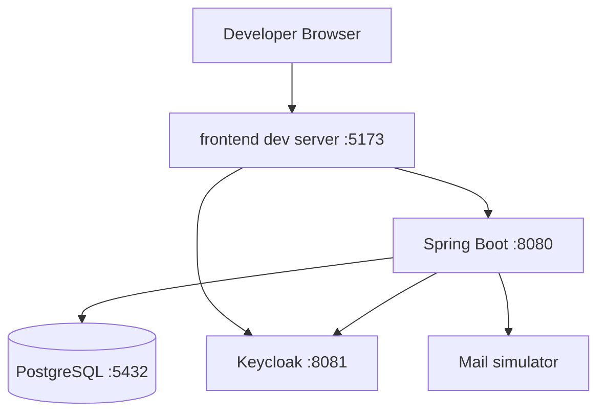
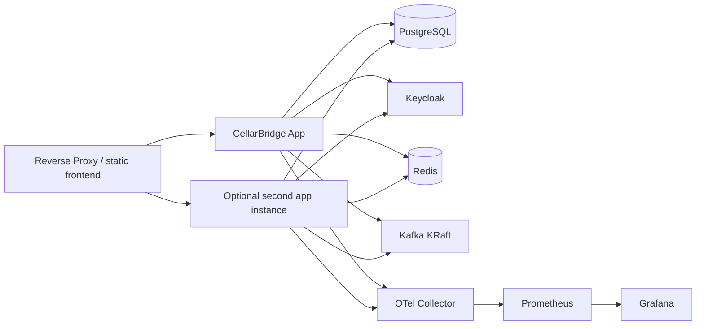

# 部署拓扑

## 1. 本地开发拓扑

目标：`make up-core` 启动依赖，`make dev`/组合命令启动应用；最终 release 可全部容器化一条命令。

## 2. Full 演示拓扑

## 3. Docker Compose profiles

- `core`: postgres, keycloak, backend, frontend/proxy；
- `messaging`: Kafka；
- `cache`: Redis；
- `observability`: OTel, Prometheus, Grafana；
- `tools`: mail simulator、数据库 UI（默认不启动）。

服务有 healthcheck、资源限制建议、持久卷、显式网络。默认凭据仅 demo profile，README 明确。

## 4. 配置

遵循外部化配置：

- `application.yml` 安全默认；
- `application-local.yml` 不含秘密；
- 环境变量/secret 注入；
- feature/profile 只控制技术适配器，不改变核心业务不变量；
- policy/template 版本作为受控种子/配置；
- 配置启动时验证，非法权重/URL/issuer 直接失败。

## 5. 数据初始化

- Flyway 结构迁移；
- `demo` profile 通过幂等 seed runner/SQL 创建合成数据；
- 重置命令需明确确认，只允许本地 demo 数据库；
- Keycloak realm 配置版本控制并可导入；
- 数据生成脚本可指定随机种子以重现。

## 6. CI/CD

Pull Request：

1. docs/link/schema validation；
2. backend format/static/compile/unit；
3. architecture verification；
4. Testcontainers integration；
5. frontend lint/type/unit；
6. contract generation diff；
7. secret/dependency scan。

Main/Release：

- 构建容器；
- image scan + SBOM；
- Docker Compose smoke/E2E；
- performance/concurrency designated workflow；
- signed/annotated tag 和 release notes；
- 发布演示截图/测试报告。

## 7. 生产化差距

公开文档必须明确以下尚未承诺：

- 托管 HA PostgreSQL、备份/PITR；
- TLS 证书和域名；
- secrets manager；
- WAF/CDN；
- 多区域；
- 正式 SRE on-call；
- 真实合规/数据驻留；
- 容量规划和成本预算。

这不降低演示价值，反而体现边界诚实。
