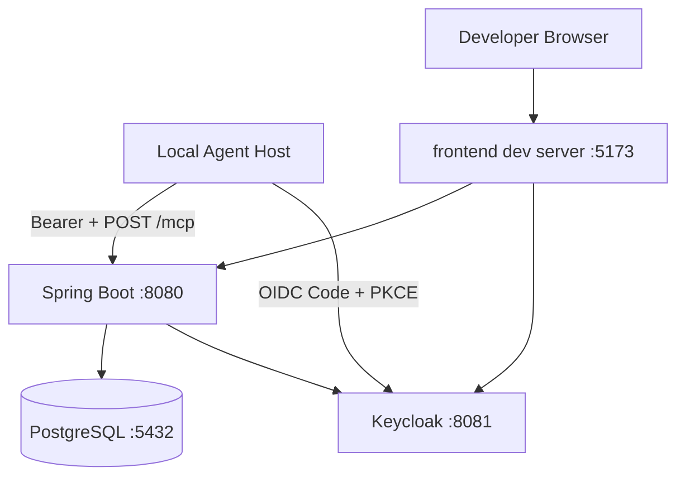
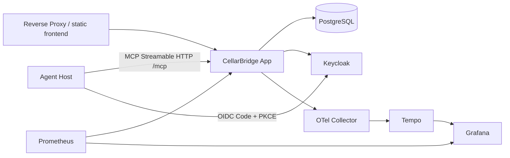

# 部署拓扑

## 1. 本地开发拓扑

当前：`make dev-core` 通过 `core.compose.yaml` 构建并启动 PostgreSQL、Keycloak、backend 和 frontend。`make dev-full` 叠加可观测 profile；两套应用镜像均以非 root 运行，backend/frontend 使用 read-only root filesystem 与受限 tmpfs。

## 2. Full 演示拓扑（Available）

## 3. Docker Compose profiles

当前仓库提供 `deploy/compose/core.compose.yaml` 和可叠加的 `deploy/compose/full.compose.yaml`：

- `core`: postgres, keycloak, backend, frontend/proxy；
- `observability`: OpenTelemetry Collector、Tempo、Prometheus、Grafana。

Task 13 不为掩盖本地事件缺陷引入 Kafka/Redis。full profile 对 DB、Keycloak 与 Grafana 管理凭据使用 required-variable 检查；core 的默认值仅服务合成数据本地演示。服务包含 healthcheck 和资源限制示例，限制值不代表生产容量结论。

## 4. 配置

遵循外部化配置：

- `application.yml` 安全默认；
- `application-local.yml` 不含秘密；
- 环境变量/secret 注入；
- feature/profile 只控制技术适配器，不改变核心业务不变量；
- policy/template 版本作为受控种子/配置；
- 配置启动时验证，非法权重/URL/issuer 直接失败。
- `CELLARBRIDGE_MCP_ENABLED=true|false` 控制同进程 MCP 适配器，生产安全默认关闭；demo/test
  显式启用且必须同时给出 canonical resource/audience、scope、client、Host/Origin 与容量边界；
- MCP endpoint 固定为 `/mcp`、模式固定为 `SYNC` + `STATELESS`，关闭后不影响 REST 主链路；
- Compose 构建仓库内 Keycloak resource-binding provider 并用两个 SPI flag 显式启用；回滚时
  先关闭 MCP，再撤回 provider，不允许退回仅静态 audience 的令牌；
- Agent Host 不属于 Compose，也不由 CellarBridge 托管；生产反向代理必须保留
  `Authorization`、`Origin`、`MCP-Protocol-Version` 与内容协商头。

## 5. 数据初始化

- Flyway 结构迁移；
- `demo` profile 通过幂等 seed runner/SQL 创建合成数据；
- 当前没有 demo reset endpoint；未来新增时必须仅注册于 demo profile、要求显式权限并拒绝非 demo 数据库；
- Keycloak realm 配置版本控制并可导入；
- 数据生成脚本可指定随机种子以重现。

## 6. CI/CD

Pull Request：

1. docs/link/schema validation；
2. backend format/static/compile/unit；
3. architecture verification；
4. Testcontainers integration；
5. MCP integration、真实 OIDC smoke 与协议 conformance；
6. frontend lint/type/unit；
7. contract generation diff；
8. secret/dependency scan。

Main/Release：

- 构建容器；
- image scan + SBOM；
- Docker Compose smoke/E2E；
- performance/concurrency designated workflow；
- signed/annotated tag 和 release notes仍由 Task 15 完成；
- dashboard source、精炼证据和机器可读 CI report 分离保存。

## 7. 生产化差距

公开文档必须明确以下尚未承诺：

- 托管 HA PostgreSQL、备份/PITR；
- TLS 证书和域名；
- secrets manager；
- WAF/CDN；
- 多区域；
- 正式 SRE on-call；
- Agent Host 的凭据托管、模型治理、DLP 与终端批准策略；
- MCP 动态客户端注册、token exchange 与 credential forwarding；
- 真实合规/数据驻留；
- 容量规划和成本预算。

这不降低演示价值，反而体现边界诚实。
