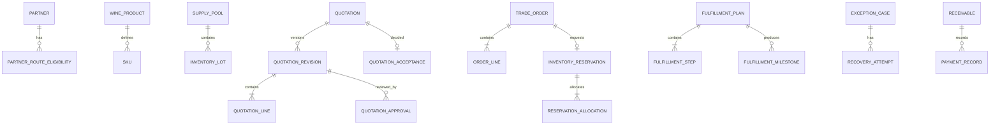

# 数据库设计

## 1. 设计原则

- PostgreSQL 18；
- module schema ownership；
- UUID primary key + human business number；
- tenant_id 每业务表；
- UTC `timestamptz`；
- 金额 `numeric(19,4)`（显示精度由币种控制）；
- quantity `numeric(19,6)`；
- mutable aggregate `version bigint`；
- created/updated metadata；
- 不跨模块 FK；
- 业务历史用快照/追加记录。

## 2. 逻辑 ER 图



图中跨模块关系为逻辑 ID，不等于 FK。

## 3. 关键表

### `partner.partner`

- id UUID PK；tenant_id；number；legal_name；display_name；type；status；default_currency；payment_term_code；credit_limit；sales_owner_id；version；timestamps。
- unique `(tenant_id, number)`；可选 identifier unique partial。

### `catalog.sku`

- id；tenant；product_id（同 schema FK）；code；vintage_code；volume_ml；units_per_case；package_type；status；search_vector；version。
- unique `(tenant_id, code)` 和业务组合。

### `inventory.inventory_lot`

- id；tenant；supply_pool_id；sku_id（逻辑 Catalog ID）；lot_code；status；on_hand_quantity；reserved_quantity；available_from；received_at；version。
- check nonnegative and reserved <= on_hand；索引 `(tenant_id, sku_id, status, available_from)`。

### `quotation.quotation`

- id；tenant；number；partner_id；status；current_revision_no；owner_id；accepted_revision_no；order_id（逻辑）；version；timestamps。
- unique `(tenant, number)`。

### `quotation.quotation_revision`

- id；quotation_id（同 schema FK）；revision_no；status；currency；expires_at；selected_route_code；route_evaluation_id；price_policy_version；approval_policy_version；subtotal/total；snapshot_hash；frozen_at。
- unique `(quotation_id, revision_no)`。

### `trade_order.trade_order`

- id；tenant；number；source_quotation_id；source_revision_id；partner_id；status；currency；total；commercial_snapshot JSONB；snapshot_hash；version。
- unique `(tenant, source_quotation_id)`。

### `inventory.inventory_reservation`

- id；tenant；number；order_id；status；request_hash；failure_summary JSONB；version。
- unique `(tenant, order_id)`。

### `inventory.reservation_allocation`

- reservation_id；order_line_id；lot_id；quantity；status；version；unique business keys。

### `fulfillment.fulfillment_plan`

- id；tenant；number；order_id；route_code；template_code/version；status；planned/actual times；version。
- unique `(tenant, order_id)` P1。

### `platform_event.event_publication`

- event_id；tenant；event_type/version；subject；payload JSONB；status；attempts；next_attempt_at；claim_owner/until；occurred_at/published_at；correlation/causation。

### `platform_event.event_inbox`

- consumer_name；event_id；tenant；status；result_hash；attempts；processed_at；PK `(consumer_name,event_id)`。

## 4. 快照

快照 JSONB 具有 schemaVersion 和 hash；关键可查询字段仍拆列。写入后不可原地变更；若 schema 演进，读取兼容旧版本或异步迁移另建字段，不重解释历史。

## 5. 审计

业务表保留 created/updated actor，完整业务时间线由事件投影和不可变决定表；不使用一个通用数据库 trigger 捕获所有字段作为唯一审计，因为它缺乏业务语义。数据库约束与审计事件互补。

## 6. 索引

- 所有 tenant 查询索引以 tenant_id 开头；
- 唯一键包含 tenant；
- 工作队列 `(tenant,status,due_at,id)`；
- event publication `(status,next_attempt_at,occurred_at)`；
- audit `(tenant,subject_type,subject_id,occurred_at desc)`；
- JSONB 仅在有查询证据时 GIN；
- 避免为每列预建索引。

## 7. 数据约束

示例：

```sql
CHECK (on_hand_quantity >= 0)
CHECK (reserved_quantity >= 0)
CHECK (reserved_quantity <= on_hand_quantity)
CHECK (total_amount >= 0)
CHECK (version >= 0)
```

状态枚举可用 varchar + check/应用 enum，以迁移便利为准；改变状态集合需迁移和兼容测试。

## 8. 物理删除

- 主数据：停用；
- 草稿可软删除/取消并保留最小审计；
- 交易、付款、审计、事件不物理删除于演示生命周期；
- 合成 demo reset 只在专用 profile 执行整租户重建。

## 9. 详细 DDL

Design Baseline 提供逻辑设计；实际 migration 在对应纵向切片创建，并通过 PostgreSQL catalog fitness tests 验证。不得在 Task 01 一次性创建所有空表。
