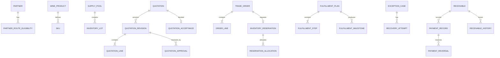

# 数据库设计

## 1. 设计原则

状态边界：V2～V22 已覆盖身份、交易、库存预占、履约、异常、结算和审计报表纵向切片；历史迁移不可重写，
当前结算能力只记录外部付款事实，不连接真实支付、总账、发票或税务系统。

- PostgreSQL 18；
- module schema ownership；
- UUID primary key + human business number；
- tenant_id 每业务表；
- UTC `timestamptz`；
- 金额列名以 amount/price/cost/charge(s)/fee(s)/tax/balance/total/subtotal 结尾并使用 `numeric(19,4)`（显示精度由币种控制）；
- quantity `numeric(19,6)`；
- mutable aggregate `version bigint`；
- created/updated metadata；
- 不跨模块 FK；
- 业务历史用快照/追加记录。

## 2. 逻辑 ER 图



图中跨模块关系为逻辑 ID，不等于 FK。

## 3. 关键表

### `partner.partner`

- id UUID PK；tenant_id；number；legal_name；display_name；type；status；default_currency；payment_term_code；credit_limit；sales_owner_id；version；timestamps。
- unique `(tenant_id, number)`；可选 identifier unique partial。

### `catalog.sku`

- id；tenant；product_id（同 schema FK）；code；vintage_code；volume_ml；units_per_case；package_type；status；search_vector；version。
- unique `(tenant_id, code)` 和业务组合。

### `inventory.inventory_lot`

- id；tenant；supply_pool_id；sku_id（逻辑 Catalog ID）；lot_code；status；quantity_unit（`CASE`/`BOTTLE`）；on_hand_quantity；reserved_quantity；available_from；received_at；version。
- check nonnegative、reserved <= on_hand 和明确单位；单位感知索引 `(tenant_id, sku_id, quantity_unit, status, available_from, supply_pool_id, id)`。

### `inventory.warehouse`

- id；tenant；code；name；country_code；city；status；allocation_priority；version；timestamps。
- `allocation_priority >= 0`，数值越小只表示未来确定性分配策略中的较早顺序；当前没有运行时修改 API，也不表示已经完成分配。

### `catalog.sku_supply_projection`

- tenant；sku_id；supply_pool_id；quantity_unit；supply_type；availability_class；quantity_band；预计日期；自动预占标志；数据时间与版本。
- PK `(tenant_id, sku_id, supply_pool_id, quantity_unit)` 允许同一 pool/SKU 分别保存 CASE 和 BOTTLE；该表仍是非承诺、可过期的 Catalog-owned 展示投影，不是库存正确性事实源。

### `quotation.quotation`

- id；tenant；number；partner_id；status；current_revision_no；owner_id；accepted_revision_no；order_id（逻辑）；version；timestamps。
- unique `(tenant, number)`。

### `quotation.quotation_revision`

- id；quotation_id（同 schema FK）；revision_no；status；currency；expires_at；selected_route_code；route_evaluation_id；Supply Decision status/schema/policy/time/hash/JSON；price/approval policy；subtotal/total；frozen_at。
- unique `(quotation_id, revision_no)`。

### `trade_order.trade_order`

- id；tenant；number；source_quotation_id；source_revision_id；partner_id；status；currency；total；commercial_snapshot JSONB；snapshot_hash；version。
- unique `(tenant, source_quotation_id)`。

### `trade_planning.evaluation`

- V12 增加 nullable 的 Supply Decision schema/policy/time/hash/summary 五列，并要求全空或全完整；`ROUTE-2026-03` 必须完整且 decision time 等于 evaluated time。
- 根列与 JSON 的 schema、policy、hash、evaluation ID、input hash、selected route 交叉校验；Repository 读回时重算独立 Decision Hash。
- 该证据属于 Planning，不写 `quotation` 或 `inventory`，也不表示已预占具体 Pool/Lot。

### `inventory.reservation`

状态：**Task 08 A2 implemented in review**。

- id；tenant_id；order_id；request/supply-decision hash；route；status/failure；受约束 request lines；version/timestamps。
- unique `(tenant_id, order_id)` 与 tenant-scoped request-hash identity；读取必须 fail closed。

### Inventory-owned Reservation facts

状态：**Task 08 C1 implemented in review**。

- `reservation_attempt`、`allocation`、`inventory_movement`、`shortage_snapshot` 为 append-only Repository 事实，数量使用 `numeric(19,6)`。
- Lot reserve/release/consume 使用 tenant/unit/balance 条件的单语句更新。
- V17 增加 actor-scoped request hash 的 `reservation_operation_command` 和 append-only `reservation_operation_audit`；组合外键绑定同一 Reservation/action/actor/key 摘要，原始 Idempotency-Key 不落库。

### `fulfillment.fulfillment_plan`

- id；tenant；number；order_id；route_code；template_code/version；status；planned/actual times；version。
- unique `(tenant, order_id)` P1。

### Settlement-owned facts

- `receivable_trigger_policy`：配置唯一 active 的触发策略，保存 code、version 和
  `FULFILLMENT_COMPLETED` trigger type；新策略通过新版本演进，不重解释历史应收。
- `order_snapshot`：从 `TradeOrderCreatedV1` 保存 tenant/order/customer/currency/amount/payment term、
  source event/hash 和触发策略快照；不与 Trade Order 建跨 schema FK。
- `receivable`：`(tenant_id, order_id, trigger_policy_code, trigger_policy_version)` 与
  `(tenant_id, trigger_type, trigger_id)` 双唯一；金额统一 `numeric(19,4)`，余额由约束校验，
  version 支持 `If-Match` 并发控制。
- `payment_record`：`(tenant_id, external_reference)` 和幂等键摘要唯一；只追加，数据库 rewrite rule
  将 update/delete 改写为空操作。
- `payment_reversal`：引用同 tenant、同 receivable 的原付款，允许多次部分冲正；只追加且原因必填。
- `receivable_history`：保存创建、付款、冲正和逾期状态证据；只追加。
- 逾期扫描使用 `FOR UPDATE SKIP LOCKED` 的有界批次；付款和扫描都锁定应收行，最终状态由余额、
  due date 与注入 Clock 统一推导。

### Audit/Reporting-owned facts

- `projection_generation` 保存同租户的 `ACTIVE/STAGING/RETIRED/FAILED` 代际；唯一 partial index
  保证最多一个 active generation，重建在 staging 完成后原子切换。
- `projector_inbox` 以 `(tenant, projector, event)` 去重，并用全局 projector/event 绑定约束拒绝
  tenant 或 payload 重绑定；`projector_checkpoint` 记录 processed/duplicate/pending/dead-letter 和 lag。
- `audit_entry` 是 allow-list 业务证据，数据库 trigger 拒绝 update/delete；不保存原始事件 payload、
  token、地址或内部评论。
- `timeline_projection`、`subject_state_projection`、`work_item_projection` 和
  `metric_fact_projection` 都带 tenant/generation；业务版本、occurredAt、eventId 决定乱序覆盖规则。
- timeline、work queue、metric date-range 的代表查询均有 tenant-first index；请求不跨模块写表联表。

### `platform_event.event_publication`

- event_id；tenant；event_type/version；subject；payload JSONB；status；attempts；next_attempt_at；claim_owner/until；occurred_at/published_at；correlation/causation。

### `platform_event.event_inbox`

- consumer_name；event_id；tenant；status；result_hash；attempts；processed_at；PK `(consumer_name,event_id)`。

## 4. 快照

快照 JSONB 具有 schemaVersion 和 hash；关键可查询字段仍拆列。写入后不可原地变更；若 schema 演进，读取兼容旧版本或异步迁移另建字段，不重解释历史。

## 5. 审计

业务表保留 created/updated actor，完整业务时间线由事件投影和不可变决定表；不使用一个通用数据库 trigger 捕获所有字段作为唯一审计，因为它缺乏业务语义。数据库约束与审计事件互补。

## 6. 索引

- 所有 tenant 查询索引以 tenant_id 开头；
- 唯一键包含 tenant；
- 工作队列 `(tenant,status,due_at,id)`；
- event publication `(status,next_attempt_at,occurred_at)`；
- audit `(tenant,subject_type,subject_id,occurred_at desc)`；
- JSONB 仅在有查询证据时 GIN；
- 避免为每列预建索引。

## 7. 数据约束

示例：

```sql
CHECK (on_hand_quantity >= 0)
CHECK (reserved_quantity >= 0)
CHECK (reserved_quantity <= on_hand_quantity)
CHECK (total_amount >= 0)
CHECK (version >= 0)
```

状态枚举可用 varchar + check/应用 enum，以迁移便利为准；改变状态集合需迁移和兼容测试。

## 8. 物理删除

- 主数据：停用；
- 草稿可软删除/取消并保留最小审计；
- 交易、付款、审计、事件不物理删除于演示生命周期；
- 合成 demo reset 只在专用 profile 执行整租户重建。

## 9. 详细 DDL

Design Baseline 提供逻辑设计；Flyway/Testcontainers 可从空库执行到 V22，并保留既有升级链与
migration ownership/hash 证据。V21 owner=`audit_reporting`；V22 owner=`fulfillment`，只扩展 demo adapter 的受控 `TIMEOUT` 场景约束。两者均不创建跨 Schema FK。
