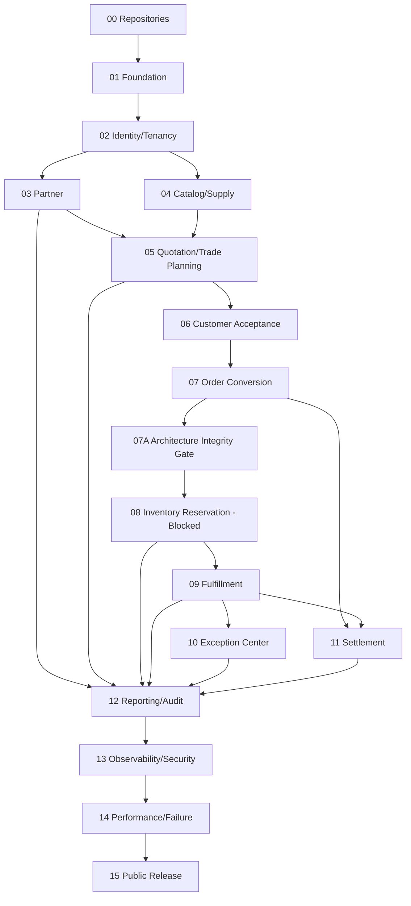

# 工作分解与依赖

## 1. 依赖图

## 2. Task 00 — Repository Baseline

**输入**：本设计包。**输出**：public `cellarbridge-platform`、private `cellarbridge-project-control`。

子任务：

- 验证 GitHub 身份/同名仓库；
- public 只提交 `public-repository` 内容；
- private 提交控制材料和 prompts；
- docs CI、issue/PR templates；
- 分主题 commits；
- tag design baseline；
- 记录 remote/commit/handoff。

## 3. Task 01 — Foundation

子任务：

- Java 21/Maven Wrapper/Spring Boot/Modulith；
- React/TS/Vite/pnpm；
- PostgreSQL/Keycloak compose；
- module package skeleton（无空 CRUD）；
- shared error/tenant/correlation primitives；
- OpenAPI codegen；
- Testcontainers and architecture test harness；
- docs/contract/CI workflows；
- Makefile scripts。

退出：登录可见空导航；health/readiness；architecture verify；双租户 fixture。

## 4. Task 02 — Identity & Access

- realm import/client/roles；
- JWT validation；
- tenant/user mapping；
- permission evaluator；
- frontend OIDC adapter/guards；
- `/me`；
- security headers/log redaction；
- role seed and tests。

## 5. Task 03 — Partner

- migrations；Partner aggregate；application commands；review policy；events；
- list/detail/create/update/submit/review API；
- React list/detail/review；
- work item/audit minimal vertical support；
- unit/module/DB/API/Playwright tests。

## 6. Task 04 — Catalog/Supply

- Product/SKU and supply pool/lot read model；
- synthetic catalog generator；
- PostgreSQL FTS/trigram；
- search API/page；
- availability disclaimer；
- query plan/performance test；
- no reservation yet。

## 7. Task 05 — Quotation/Trade Planning

- Money/Quantity；Quotation aggregate；
- PriceCalculation/Approval/Route policies；
- route policy/config/version；
- migrations, API, React editor/approval；
- deterministic/property tests；
- customer-safe projection preparation。

## 8. Task 06 — Customer Acceptance

- issue/public token；
- dedicated portal response；
- accept/reject and expiration scheduler；
- HTTP idempotency store；
- customer portal UI；
- concurrent accept/field security tests。

## 9. Task 07 — Order Conversion

- QuotationAccepted contract；
- reliable publication and Inbox；
- order aggregate/migrations；
- quote unique and snapshot hash；
- order detail and timeline stub；
- duplicate/crash tests。

## 10. Task 08 — Inventory

**Status: Blocked.** Task 07A 先后交付 `integrity-core` 与 `inventory-readiness`；两个准备 PR 均合并前不得开始 reservation/allocation/movement 或订单预占状态 handler。

### Task 07A gate evidence

- core：持久化/事件/迁移 ADR，领域边界、accepted-event/hash、金额不变量与通用 fitness；
- inventory readiness：V10 数量单位、仓库优先级、Inventory API/generated types/React/seed 与 Task 08 准备契约；
- 两阶段都不实现实际 reservation、allocation 或 movement。

- lot/reservation/movement schema；
- allocation policy and JDBC atomic updates；
- reservation process manager；
- order status consumers；
- React reservation view；
- concurrent Testcontainers suite；
- failure shortages and exception trigger。

## 11. Task 09 — Fulfillment

- templates and seed versions；
- plan/step/dependency aggregate；
- event consumers；
- board/detail/customer milestones；
- SLA scheduler；
- simulated adapter with idempotency；
- dependency and restart tests。

## 12. Task 10 — Exception

- exception aggregate/schema；
- source failure consumers；
- work queue/assignment；
- recovery catalog/commands；
- system event failure view；
- React exception center；
- duplicate and recovery tests。

## 13. Task 11 — Settlement

- receivable/payment/reversal；
- trigger policy；
- API/UI；
- external reference idempotency；
- money/overdue scheduler tests。

## 14. Task 12 — Audit/Reporting

- event projection framework；
- timeline, dashboard, work items；
- customer/internal views；
- checkpoint/rebuild；
- ECharts pages；
- duplicate/ordering/rebuild/tenant tests。

## 15. Task 13–15

质量强化不可用于大规模重写业务。先收敛缺口：observability、安全、性能、故障、文档、release。任何架构变化需独立 ADR/PR。
