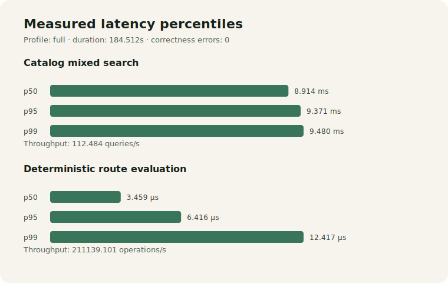

# Performance evidence report

Status: **Available in Task 14**

This report describes repeatable evidence for the committed modular-monolith runtime. It is not a production capacity claim. Results are valid only for the recorded revision, profile, seed, host resources, container limits, JVM and PostgreSQL version in `target/performance-evidence/<profile>/result.json`.

## Evidence design

The repository uses a lean harness rather than introducing k6, Gatling or JMH:

- `performance/generate_dataset.py` creates deterministic gzip JSONL fixtures and a SHA-256 manifest using a versioned profile and fixed seed;
- `RouteEvaluationPerformanceTest` measures the production `RouteEvaluationPolicy`, with deterministic candidate and recommendation assertions in every measured iteration;
- `scripts/catalog_search_benchmark.sh` builds a fresh PostgreSQL schema, checks fixture cardinality and the unit-aware index plan, and records p50/p95/p99, throughput and error rate;
- existing PostgreSQL integration tests supply concurrent quotation acceptance, quote-to-order, hot/distributed inventory, event backlog and reporting rebuild evidence;
- `performance/run_experiments.py` rejects missing Surefire methods, failed assertions, fixture drift, missing backlog metrics or a changed Redis runtime boundary before it writes the suite result.

No schema, index or production algorithm was changed to improve a benchmark number. V22 only adds the `TIMEOUT` value to the existing fulfillment demonstration constraint.

## Profiles

| Profile | Intended budget | Synthetic data | Measured settings |
|---|---:|---|---|
| `smoke` | 10 minutes | 500 products, 1,500 SKUs, 10,000 lots, 100 partners, 5,000 quotations, 3,000 orders, 20,000 events | 500-product catalog fixture, 15 SQL samples, 5,000 route iterations, 100 publication events plus duplicates |
| `full` | 30 minutes | 5,000 products, 15,000 SKUs, 100,000 lots, 1,000 partners, 100,000 quotations, 60,000 orders, 1,000,000 events | 5,000-product catalog fixture, 100 SQL samples, 100,000 route iterations, 1,000 publication events plus duplicates, Keycloak outage/recovery |

The generated manifest records exact counts, seed `140726`, generator version, profile hash, per-file record count, compressed size and SHA-256. Generation is independently checked for byte-for-byte determinism.

## Representative smoke result

A local candidate run on 2026-07-22 completed with zero failed correctness scenarios. The machine-readable artifact remains authoritative and records that the run was made against the Task 13 base with Task 14 working-tree changes present.

| Scenario | Scale | Result |
|---|---:|---:|
| Catalog mixed FTS/trigram/unit search | 500 products / 1,500 SKUs / 4,500 projections / 4,500 lots | p50 1.164 ms; p95/p99 1.223 ms; 881.368 queries/s; 0 errors |
| Deterministic route evaluation | 1,000 warmups / 5,000 measured | p50 11.625 μs; p95 34.667 μs; p99 73.208 μs; 39,664.229 operations/s; 0 errors |
| Local publication backlog | 100 events delivered twice | one side effect per event, all duplicates recorded, 0 errors |

The catalog plan used the unit-aware projection index, every query succeeded, and all expected fixture cardinalities matched.

## Representative full result

The same local candidate completed the full harness in **184.512 seconds**, within the 30-minute profile budget. It generated the 1,000,000-event corpus and passed all 16 selected correctness tests plus the Keycloak stop/recovery scenario.

| Scenario | Scale | Result |
|---|---:|---:|
| Catalog mixed FTS/trigram/unit search | 5,000 products / 15,000 SKUs / 45,000 projections / 45,000 lots | p50 8.914 ms; p95 9.371 ms; p99 9.480 ms; 112.484 queries/s; 0 errors |
| Deterministic route evaluation | 10,000 warmups / 100,000 measured | p50 3.459 μs; p95 6.416 μs; p99 12.417 μs; 211,139.101 operations/s; 0 errors |
| Local publication backlog | 1,000 events delivered twice | 1,250.615 deliveries/s; 1,000 duplicate deliveries; exactly 1,000 side effects; 0 errors |

The measured SQL-search and route-policy components are below the NFR-PERF-001 and NFR-PERF-003 endpoint budgets on the recorded environment, but component timings do not prove those end-to-end NFRs. No claim is made for NFR-PERF-002, NFR-PERF-004 or NFR-PERF-005 latency because this harness protects their correctness paths but does not yet drive production-shaped HTTP traffic.



The chart is rendered directly from the full-profile `result.json`; it is not edited by hand. Rebuild it with:

```bash
python3 performance/render_summary.py \
  --result target/performance-evidence/full/result.json \
  --output docs/evidence/performance/measured-latency.svg
```

## Interpretation and trade-offs

Catalog search is the measured bottleneck: increasing the SQL fixture from 500 to 5,000 products raised p50 from 1.164 ms to 8.914 ms, while pure in-process route evaluation remained in microseconds. The unit-aware index and all fixture/cardinality assertions still passed, so Task 14 did not change an index or algorithm merely to improve the number. There is consequently no before/after optimization claim; a future optimization must preserve both result artifacts and query plans.

The current evidence favors a modular monolith and PostgreSQL local publication/inbox. The workload does not show a module that needs independent scaling, while splitting it now would add network, deployment and cross-service consistency failure modes without removing the observed catalog query boundary. This is a reversible trade-off: sustained production-shaped HTTP evidence, independent ownership or materially different scaling needs would justify a new ADR.

Unresolved risks are HTTP/network latency, cold-cache and long-duration behavior, production data skew, key rotation during an identity outage, and multi-instance saturation. They remain explicit release boundaries rather than inferred from local throughput.

## Correctness gates

The same run must pass all of the following before performance data is accepted:

- twenty-way quotation acceptance and quote-to-order duplicate/concurrency handling;
- shared hot-lot and distributed inventory contention without overselling or negative balances;
- duplicate and out-of-order local event delivery, transaction rollback, bounded retry and backlog drain;
- a real PostgreSQL deadlock translated to a bounded retryable failure followed by ordered recovery;
- reporting stale-event rejection, closing-before-opening resolution and atomic staging rebuild;
- fulfillment timeout persistence, SLA idempotency, source-verified recovery and production-default fault-control rejection.

The suite records each selected test method and duration. Concurrency tests use latches/barriers and database locks; they do not use fixed sleeps to manufacture overlap.

## Reproduction and artifacts

```bash
make performance-smoke
make performance-full
```

Generated evidence is intentionally ignored under `target/performance-evidence/<profile>/`. `result.json` is the entry point; its artifact list links the dataset manifest, SQL plans, raw execution times, route metrics and correctness log. Pull-request CI runs `smoke`; the heavier `full` profile is a manual workflow choice.

## Limits

- Local results do not predict cold-cache behavior, network latency, production skew, regional deployment or long-duration write amplification.
- The synthetic JSONL corpus is a reproducible capacity description; the SQL catalog benchmark uses a separately seeded schema optimized for query-plan inspection.
- PostgreSQL local publication/inbox is the deployed event transport. No Kafka or external broker result is claimed.
- Redis is not installed and is not part of the correctness path; its absence is verified rather than simulated as a cache outage.
